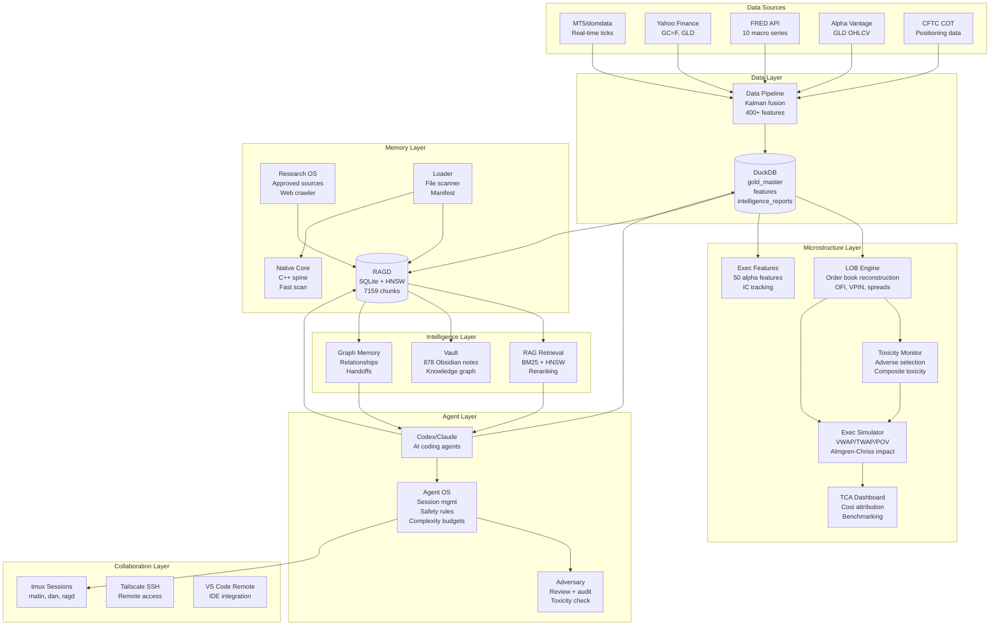

# Dominion V2 System Overview

**Version:** 2.0  
**Status:** SOURCE_GREEN | LIVE_WARN (run `dominion doctor` for details)  
**Last Updated:** 2026-05-19

---

## What Is Dominion?

Dominion V2 is a **local-first, agent-native quantitative research and engineering workstation** built for systematic XAU/USD (gold) trading analysis.

Core principles:
- **Sovereign infrastructure:** Runs entirely on WSL/Debian (no cloud dependencies)
- **Read-only market data:** MT5 connection is data-only, zero trading execution
- **Agent-native:** Designed for AI coding agents (Codex, Claude Code, Cursor)
- **RAGD-first:** Persistent memory and retrieval system powers everything
- **Validated:** 24 C++ tests passing, safety scanner passing
- **Collaborative:** tmux + SSH + Tailscale for Matin/Dan collaboration

**Mission:** Build institutional-grade quant research platform that is:
- Self-documenting
- Self-testing
- Self-maintaining
- Agent-friendly
- Human-friendly
- Scalable from 1 → 10,000 person-equivalent capacity

---

## Core Layers

### 1. **RAGD (Retrieval-Augmented Graph Database)**

Persistent project memory system.

**Purpose:**
- Store all project knowledge (docs, code, decisions, handoffs)
- Enable semantic retrieval for AI agents
- Provide context for code generation
- Track system state over time
- Support MCP (Model Context Protocol)

**Key Features:**
- Native C++ implementation (ragd/)
- SQLite + HNSW vector index
- REST API on 127.0.0.1:7474
- AST-aware chunking
- Graph memory for relationships
- Agent coordination (REST API operational, WebSocket /bus planned)
- 7159 active chunks (as of 2026-05-19)

**Status:** Operational (daemon running in tmux session `ragd`)

**Docs:** [docs/02_RAGD/](../02_RAGD/)

---

### 2. **domdata (MT5 Data Bridge)**

Read-only MetaTrader5 integration via Wine.

**Purpose:**
- Connect to MT5 platform for real-time XAU/USD tick data
- Provide safe, read-only market data access
- Block all trading operations at multiple layers
- Enable backtesting and analysis

**Key Features:**
- Wine/MT5 integration
- Read-only investor account
- Forbidden token scanner (blocks trading code)
- CLI wrapper: `domdata xautick`, `domdata xaurates`, etc.
- Real-time tick streaming
- Historical data access

**Safety Guarantees:**
- `domdata order-send` is blocked
- Trading tokens (order_send, order_check, TRADE_ACTION_*) are forbidden
- Multiple safety layers (investor account, token scanner, CLI guards)

**Status:** Operational, validated

**Docs:** [docs/DOMDATA.md](../DOMDATA.md)

---

### 3. **Data Pipeline (Multi-Source Fusion)**

Institutional-grade XAU/USD data pipeline with 5 sources and 400+ features.

**Purpose:**
- Fuse multiple gold price sources (Yahoo, FRED, Alpha Vantage, CFTC, MT5)
- Kalman filtering with dynamic trust scoring
- Generate 400+ alpha features
- HMM regime detection
- Health monitoring and anomaly detection
- Daily intelligence reports

**Key Features:**
- **5 sources:** Yahoo Finance (GC=F, GLD), FRED (10 macro series), Alpha Vantage, CFTC COT, MT5/domdata
- **Kalman filter bank:** 6 timescales (tick → daily) with Byzantine fault tolerance
- **400+ features:** Price, microstructure, cross-asset, COT, macro, regime, calendar
- **Health monitoring:** Staleness watchdog, gap detection, drift detection, anomaly detection
- **Intelligence reports:** Daily markdown reports + DuckDB storage + RAGD ingestion

**Status:** Operational (16/16)

**Docs:** [docs/DATA_PIPELINE.md](../DATA_PIPELINE.md), [docs/05_FEATURES/DATA_PIPELINE_FEATURE.md](../05_FEATURES/DATA_PIPELINE_FEATURE.md)

---

### 4. **Microstructure Subsystems**

5 advanced subsystems for market microstructure analysis (week-long implementations each).

#### a. **LOB Reconstruction Engine** (`lob/`)
- Tick ingestion + 10-level order book state machine
- Metrics: OFI (1s/5s/1m), VPIN, Roll/Corwin-Schultz spreads, depth-weighted mid
- DuckDB: lob_snapshots, lob_events, lob_metrics
- CLI: `python -m lob.cli compute|metrics|vpin`
- Status: 8/8 tests passing

#### b. **Execution Simulator** (`exec_sim/`)
- VWAP/TWAP/POV strategies with Almgren-Chriss market impact
- Order matching + partial fills + slippage tracking
- DuckDB: sim_strategies, sim_orders, sim_performance
- CLI: `python -m exec_sim.cli run|report|compare`
- Status: 8/8 tests passing

#### c. **TCA Dashboard** (`tca/`)
- Transaction cost attribution (decision/timing/impact/opportunity)
- Benchmark vs VWAP/TWAP + regime conditioning
- DuckDB: tca_trades, tca_attribution, tca_benchmarks
- CLI: `python -m tca.cli analyze|report|heatmap`
- Status: 4/4 tests passing

#### d. **Toxicity Monitor** (`toxicity/`)
- VPIN + OFI + adverse selection metrics
- Composite toxicity score + alerting
- DuckDB: toxicity_metrics, toxicity_alerts
- CLI: `python -m toxicity.cli compute|status|alerts`
- Status: 4/4 tests passing

#### e. **Execution Alpha Features** (`exec_features/`)
- 50 execution-quality features (spread/depth/flow/quote/trade)
- IC tracking (60-min forward returns) + decay monitoring
- DuckDB: execution_features, feature_decay_alerts
- CLI: `python -m exec_features.cli compute|top|decay`
- Status: 6/6 tests passing

**Integration:** LOB → Toxicity → ExecSim → TCA → All feed data pipeline

**Status:** Operational (30/30)

**Docs:** [docs/05_FEATURES/](../05_FEATURES/)

---

### 5. **Agent OS (dominion_agent)**

SQLite-backed operating system that constrains, observes, and audits AI coding agents.

**Purpose:**
- Enforce session identity and lifecycle
- Provide file locking for safe concurrent edits
- Apply safety rules (no trading, no secrets, no destructive ops)
- Track complexity budgets
- Adversarial review system
- Audit all agent actions

**Key Features:**
- Session management (init, acquire_lock, release_lock, end_session)
- Task tracking with dependencies
- File locking with scope isolation
- Safety rules (dangerous operations blocked)
- Complexity budgets per package
- Adversarial reviewer (scores agent output)
- Dashboard and "next action" recommendation

**Status:** Operational (full test coverage)

**Docs:** [docs/agents/AGENT_OS_CONTRACT.md](../agents/AGENT_OS_CONTRACT.md), [docs/agents/AGENT_OS_COMMANDS.md](../agents/AGENT_OS_COMMANDS.md)

---

### 6. **RAG Retrieval Layer (dominion_ai)**

Hybrid retrieval system for agent context loading.

**Purpose:**
- Query RAGD for relevant docs/code before agent edits
- Combine BM25 (keyword) + HNSW (semantic) retrieval
- Reciprocal Rank Fusion (RRF) for result merging
- Cross-encoder reranking
- Confidence scoring
- Evaluation framework

**Key Features:**
- Hybrid retrieval (BM25 + HNSW)
- Configurable reranking
- Trace logging for debugging
- Evaluation suite (recall, MRR, nDCG, citation accuracy)
- CLI: `dominion search`, `dominion ask`, `dominion eval`, `dominion trace`

**Status:** Operational (evaluation passing: recall@10=1.0, MRR=1.0)

**Docs:** [docs/01_ARCHITECTURE/](../01_ARCHITECTURE/), RAG subsystem docs

---

### 7. **Research OS (research_os)**

Approved-source web crawler + evidence collection system.

**Purpose:**
- Fetch documentation from approved sources (crawl4ai docs, pandas, etc.)
- Extract clean text + metadata
- Score content quality deterministically
- Chunk for RAGD ingestion
- Track provenance (URL, timestamp, hash, source)

**Key Features:**
- Fetch adapter abstraction (requests, browser/JS optional)
- Deterministic quality scoring
- Provenance tracking
- RAGD ingestion bridge
- CLI: `research status`, `research fetch`, `research doctor`, `research ingest-ragd`

**Status:** Operational (7)

**Docs:** [docs/RESEARCH_OS.md](../RESEARCH_OS.md)

---

### 8. **Native Core (ragd/)**

High-performance C++ spine for core operations.

**Purpose:**
- Fast file scanning (11x faster than Python: 18ms vs 201ms for 1282 files)
- Manifest generation (SQLite-based)
- Vault doctor (integrity checks, broken link detection)
- Offline doctor (health checks without RAGD daemon)
- Agent OS primitives (locks, scopes, evidence)

**Key Features:**
- CMake build system
- SQLite for persistence
- SHA-256 hashing
- Ignore policy enforcement
- Path normalization
- 24/24 C++ tests passing

**Status:** Operational

**Docs:** [docs/NATIVE_CORE.md](../NATIVE_CORE.md)

---

### 9. **Vault (Obsidian Knowledge Graph)**

Obsidian-compatible knowledge graph with 878 notes.

**Purpose:**
- Cross-linked documentation
- Tag-based navigation
- Daily logs
- Symbol index
- File snapshots
- Agent handoff notes

**Key Features:**
- 878 notes (as of 2026-05-19)
- 0 broken links (validated)
- Obsidian-compatible
- Auto-generated indexes
- Frontmatter metadata
- Vault doctor for validation

**Status:** Operational

**Docs:** [docs/OBSIDIAN_VAULT_MANIFEST.md](OBSIDIAN_VAULT_MANIFEST.md)

---

### 10. **Loader (dominion_loader)**

File scanning, caching, manifest generation.

**Purpose:**
- Scan repo for Python files
- Classify files (source/test/generated/vendor)
- Generate manifest (SHA-256 hashes, symbol counts)
- Cache for fast lookups
- Feed RAGD with file metadata

**Key Features:**
- Native scan integration (11x faster)
- Ignore policy enforcement
- SQLite manifest
- Symbol extraction
- Python-only and native-hybrid modes

**Status:** Operational

**Docs:** Architecture docs, dominion_loader/ code

---

### 11. **Command Center (scripts/dominion_cli.py)**

Unified CLI for all Dominion operations.

**Commands:**
```bash
# Platform health
dominion status
dominion doctor [--offline] [--deep] [--json]
dominion truth

# RAGD operations
dominion search "<query>" --top-k 5 [--json]
dominion ask "<question>" [--json]
dominion trace <trace_id>
dominion eval --bundle <path> --top-k 10 [--json]

# Scanning + manifest
dominion scan [--native] [--dry-run] [--json]
dominion cache build
dominion manifest scan

# Embedding + indexing
dominion embed stats [--json]
dominion embed run [--changed-only] [--json]

# Vault operations
dominion vault status [--json]
dominion vault build
dominion vault doctor [--json]

# Graph memory
dominion graph build [--json]
dominion graph stats [--json]

# Agent OS
dominion agent init --name <name> --role <role> [--json]
dominion agent dashboard [--json]
dominion agent next [--json]
dominion agent complexity report [--json]
dominion agent task create --name <name> --description <desc>

# Hardware probing
dominion hw probe [--json]
```

**Status:** Operational

**Docs:** [docs/COMMAND_CENTER.md](../COMMAND_CENTER.md)

---

## System Architecture



---

## Data Flow

### Ingestion Flow

```
Raw Sources → Data Pipeline → DuckDB → RAGD → Agents
```

1. **Sources:** MT5, Yahoo, FRED, Alpha Vantage, CFTC
2. **Pipeline:** Kalman fusion, feature generation, health monitoring
3. **DuckDB:** Normalized storage (gold_master, features, reports)
4. **RAGD:** Indexed for retrieval (intelligence reports, docs, code)
5. **Agents:** Query RAGD, generate insights, update code

### Agent Workflow Flow

```
Agent → RAGD Query → Context Load → Code Edit → Validation → RAGD Update → Handoff
```

1. **Agent starts:** Reads `/AGENT_HANDOFF.md`
2. **Query RAGD:** `ragd_query "<task description>"`
3. **Context load:** RAGD returns relevant docs/code chunks
4. **Code edit:** Agent makes minimal diffs
5. **Validation:** Run tests, trading check, platform health
6. **RAGD update:** `ragd_remember "<decision or finding>"`
7. **Handoff:** Update `/AGENT_HANDOFF.md`, write report

### Retrieval Flow

```
User Query → BM25 + HNSW → RRF Merge → Rerank → Filter → Result
```

1. **Query:** "how does data pipeline work"
2. **BM25:** Keyword match (top 20)
3. **HNSW:** Semantic match (top 20)
4. **RRF:** Reciprocal Rank Fusion merge
5. **Rerank:** Cross-encoder reranking (if enabled)
6. **Filter:** Remove low-confidence results
7. **Result:** Top K chunks with metadata

---

## Key Metrics

**As of 2026-05-19:**

| Metric | Value | Status |
|---|---:|---|
| Platform Status | LIVE_GREEN | ✓ |
| Python Tests Passing | 426/426 | ✓ |
| C++ Tests Passing | 24/24 | ✓ |
| RAGD Active Chunks | 7,159 | ✓ |
| RAGD Total Chunks | 8,760 | ✓ |
| Vault Notes | 878 | ✓ |
| Vault Broken Links | 0 | ✓ |
| Native Scan Speed | 18ms (1282 files) | ✓ |
| Python Scan Speed | 201ms (1281 files) | ✓ |
| Data Pipeline Tests | 16/16 | ✓ |
| Microstructure Tests | 30/30 | ✓ |
| Trading Safety Check | PASS | ✓ |
| RAGD Daemon | Running (tmux session `ragd`) | ✓ |
| RAG Recall@10 | 1.0 | ✓ |
| RAG MRR | 1.0 | ✓ |
| RAG nDCG@10 | 1.0 | ✓ |

---

## Technology Stack

**Languages:**
- Python 3.11+ (primary)
- C++17 (native core)
- Bash (scripting)

**Databases:**
- SQLite (RAGD, Agent OS, manifest, cache)
- DuckDB (data pipeline, microstructure)

**Frameworks:**
- CMake (C++ build)
- pytest (Python testing)
- CTest (C++ testing)

**Libraries:**
- MetaTrader5 (MT5 integration via Wine)
- yfinance (Yahoo Finance)
- fredapi (FRED API)
- hmmlearn (HMM regime detection)
- statsmodels (econometrics)
- scipy (scientific computing)
- pandas (data manipulation)
- numpy (numerical computing)

**Infrastructure:**
- WSL2/Debian (host OS)
- Wine (MT5 bridge)
- tmux (session management)
- Tailscale (SSH tunneling)
- Obsidian (knowledge graph)

---

## Validation Gates

Before claiming LIVE_GREEN status, must pass:

```bash
# Core validation (MANDATORY)
python domdata/check_no_trading.py  # MUST PASS
python -m pytest -q                 # MUST PASS (426/426)
ctest --test-dir ragd/build --output-on-failure  # MUST PASS (24/24)

# Platform validation (RECOMMENDED)
bash scripts/verify_live.sh         # 14/14 checks
python scripts/dominion_cli.py doctor --offline --json  # overall: warn or ok
python scripts/dominion_cli.py vault doctor --json  # ok: true
```

---

## Safety Guarantees

1. **No trading execution** — Multiple layers:
   - MT5 investor account (read-only)
   - Forbidden token scanner (`domdata/check_no_trading.py`)
   - CLI guards (`domdata order-send` blocked)
   - Agent OS safety rules (dangerous operations blocked)
   - Test-time mocking (no real orders in tests)

2. **No secret leakage** — Multiple layers:
   - `secrets/` folder excluded from scanning
   - RAGD ignores `secrets/`
   - Vault ignores `secrets/`
   - Agents forbidden from reading secret contents
   - Git ignores `secrets/`

3. **No data loss** — Multiple layers:
   - Backups in `backups/`
   - Git version control
   - Read-only operations default
   - Explicit confirmation for destructive ops
   - Agent OS locks prevent concurrent edits

4. **No hallucination** — Multiple layers:
   - RAGD retrieval provides verified context
   - Tests validate behavior
   - Doctor checks platform health
   - Adversary reviews agent output
   - Handoff protocol requires evidence

---

## Collaboration Model

**Matin (Owner):**
- Primary developer
- WSL/Debian host
- tmux session: `matin`
- Full access

**Dan (Collaborator):**
- Remote access via Tailscale SSH
- tmux session: `dan`
- VS Code Remote SSH
- Read-only on most systems
- Coordinate via tmux or chat

**Agents (Codex, Claude, Cursor):**
- Operate via RAGD-first workflow
- Constrained by Agent OS
- Reviewed by Adversary
- Write handoff reports
- Follow safety rules

---

## Next Steps

**For humans:**
1. Read [HUMAN_README.md](HUMAN_README.md) for owner's guide
2. Browse [MASTER_NAVIGATION.md](MASTER_NAVIGATION.md) for full index
3. Open Obsidian vault at `/home/Martin/Dominion/vault/`

**For agents:**
1. Read [AGENT_README.md](AGENT_README.md) for operating manual
2. Read [/AGENT_HANDOFF.md](/AGENT_HANDOFF.md) for current state
3. Query RAGD before any code changes
4. Follow validation protocol
5. Write handoff report

**For the platform:**
1. Review [06_ROADMAP/MASTER_ROADMAP.md](../06_ROADMAP/MASTER_ROADMAP.md) for future plans
2. Check [14_BACKLOG/](../14_BACKLOG/) for pending work
3. Read [09_RISK_AND_SECURITY/RISK_REGISTER.md](../09_RISK_AND_SECURITY/RISK_REGISTER.md) for known risks

---

## Resources

**Documentation:**
- [docs/INDEX.md](INDEX.md) — Master navigation
- [docs/MASTER_NAVIGATION.md](MASTER_NAVIGATION.md) — Complete TOC
- [docs/01_ARCHITECTURE/](../01_ARCHITECTURE/) — System design
- [docs/05_FEATURES/](../05_FEATURES/) — Feature specs
- [docs/06_ROADMAP/](../06_ROADMAP/) — Future plans

**Code:**
- `/home/Martin/Dominion/` — Repo root
- `ragd/` — Native C++ core
- `data_pipeline/` — Data pipeline
- `dominion_agent/` — Agent OS
- `dominion_ai/` — RAG retrieval
- `domdata/` — MT5 bridge

**Tools:**
- `python scripts/dominion_cli.py` — Unified CLI
- `curl http://127.0.0.1:7474/health` — RAGD health
- `tmux attach -t ragd` — RAGD daemon session
- `python -m pytest -q` — Run tests

---

**Status:** Operational ✓  
**Last Validated:** 2026-05-19  
**Next Review:** When major changes occur

---

**Remember:** Dominion is a living platform. Break nothing. Improve incrementally. Document everything.
