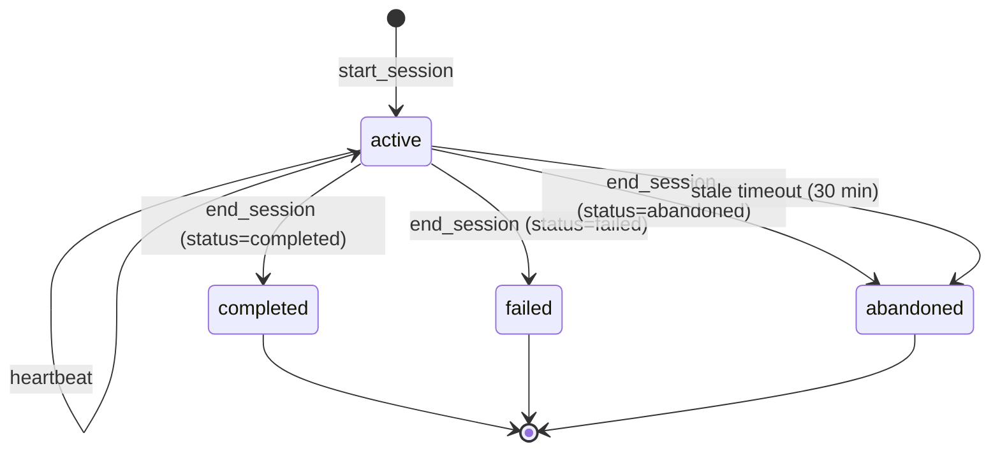
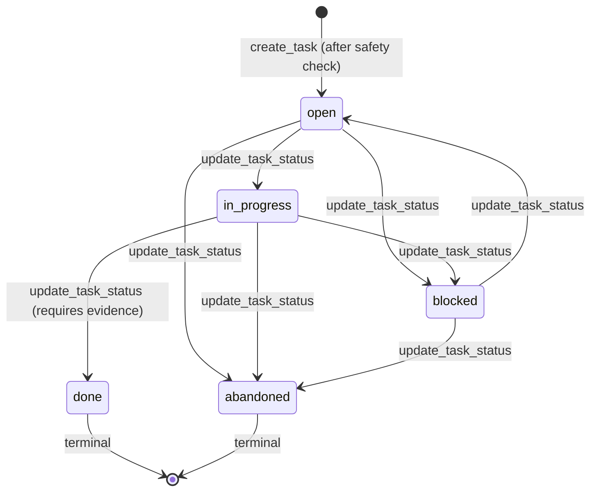
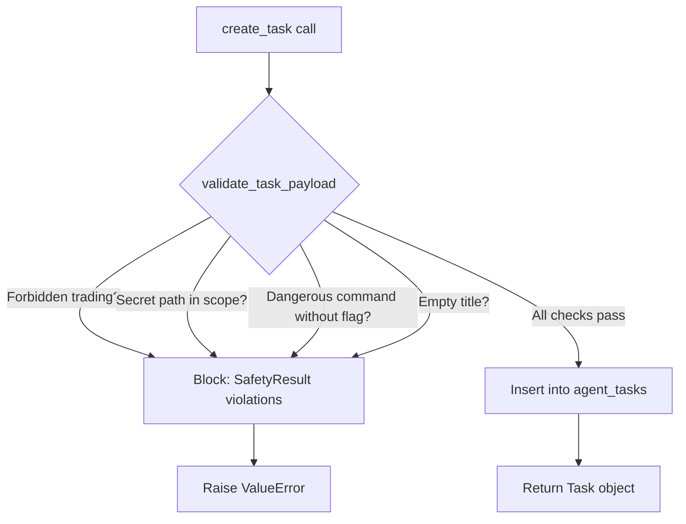
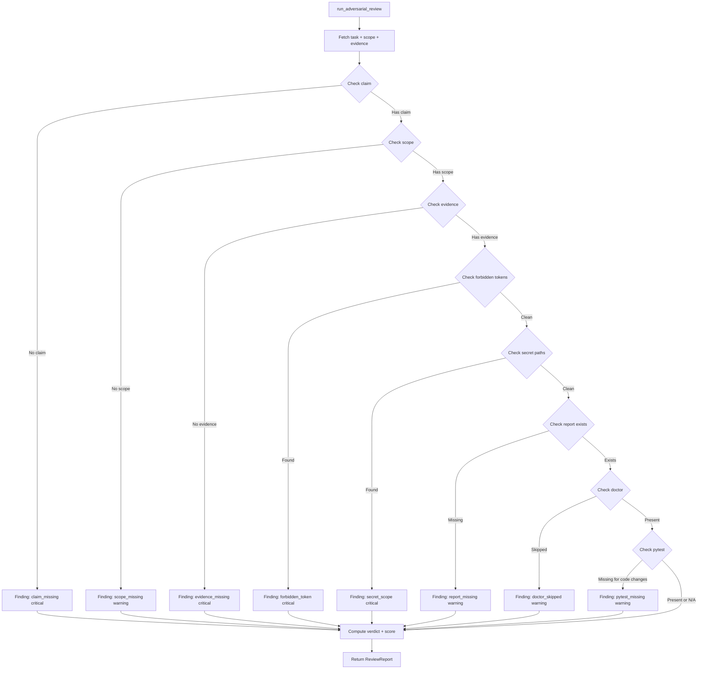

# Agent OS Architecture

**Status:** LIVE_GREEN (Production-ready agent orchestration system)  
**Last Updated:** 2026-05-19  
**Owner:** MatinDeevv  
**Related:** [DEPENDENCY_MAP.md](DEPENDENCY_MAP.md), [AGENT_OPERATING_SYSTEM.md](../03_AGENT_OPERATIONS/AGENT_OPERATING_SYSTEM.md)

---

## Overview

Agent OS is Dominion's **agent orchestration layer**. It provides lifecycle management, task tracking, safety enforcement, complexity budgeting, and adversarial review for Claude Code agents working on the Dominion codebase.

All state persists in **SQLite with WAL mode** (`~/.dominion/agent_os.db`). No global singletons — each process/agent creates its own `AgentStore` instance with autocommit + explicit transactions where needed.

**Design Principles:**
1. **Safety first** — block secrets, forbidden trading, dangerous operations
2. **State persistence** — all agent actions logged to SQLite
3. **Adversarial review** — structured checks before task completion
4. **Complexity budgets** — enforce code quality thresholds per package
5. **Concurrency** — WAL mode allows multiple agents to read/write safely

---

## Architecture Layers

```
┌─────────────────────────────────────────────────────────────┐
│                      CLI / API Layer                        │
│  dominion_agent/cli.py, dominion_agent/api.py              │
│  Commands: start, task, claim, lock, doctor, complexity    │
└─────────────────────────────────────────────────────────────┘
                            │
                            ▼
┌─────────────────────────────────────────────────────────────┐
│                   Core Services Layer                       │
│  ┌──────────────┐  ┌─────────────┐  ┌──────────────┐       │
│  │ Sessions     │  │ Tasks       │  │ Claims       │       │
│  │ (lifecycle)  │  │ (work items)│  │ (locks)      │       │
│  └──────────────┘  └─────────────┘  └──────────────┘       │
│  ┌──────────────┐  ┌─────────────┐  ┌──────────────┐       │
│  │ Safety       │  │ Complexity  │  │ Adversary    │       │
│  │ (filters)    │  │ (budgets)   │  │ (review)     │       │
│  └──────────────┘  └─────────────┘  └──────────────┘       │
└─────────────────────────────────────────────────────────────┘
                            │
                            ▼
┌─────────────────────────────────────────────────────────────┐
│                    Storage Layer                            │
│  AgentStore (SQLite WAL): sessions, tasks, claims, locks,   │
│  events, file_touches, reviews, conflicts, impacts          │
└─────────────────────────────────────────────────────────────┘
```

---

## Component Deep-Dive

### 1. **Sessions** (`sessions.py`)

Agent sessions track the **lifecycle** of each agent invocation:
- **start_session(agent_name, role)** → creates `sess_<uuid>` with git branch/commit
- **heartbeat(session_id)** → updates `last_heartbeat` (prevents stale detection)
- **end_session(session_id, status)** → marks session `completed` | `failed` | `abandoned`
- **abandon_session(session_id)** → force-abandons stale sessions (30min default threshold)

**Session States:**
```
active → (heartbeat) → active
       → (end_session) → completed | failed | abandoned
       → (stale timeout) → abandoned (manual intervention)
```

**Schema:** `agent_sessions_v2` table
```sql
session_id TEXT PRIMARY KEY,
agent_name TEXT NOT NULL,
role TEXT NOT NULL,  -- research | implementation | review | maintenance
status TEXT NOT NULL,  -- active | idle | completed | failed | abandoned
started_at INTEGER NOT NULL,
ended_at INTEGER,
last_heartbeat INTEGER NOT NULL,
git_branch TEXT,
git_commit_start TEXT,
git_commit_end TEXT,
parent_session_id TEXT,
metadata_json TEXT  -- arbitrary JSON payload
```

**Example Flow:**
```python
session = start_session("claude-sonnet-4", "implementation")
heartbeat(session.session_id)  # during long operations
end_session(session.session_id, "completed", summary="Fixed bug X")
```

---

### 2. **Tasks** (`tasks.py`)

Tasks are **work items** with scope, validation, acceptance criteria, and evidence:
- **create_task(title, description, kind, scope, validation)** → creates `task_<uuid>` after safety check
- **update_task_status(task_id, new_status, evidence)** → enforces transition rules
- **record_touch(session_id, task_id, filepath, action)** → logs file changes

**Task States:**
```
open → in_progress → done
     → blocked
     → abandoned
```

**Transition Rules (`TASK_TRANSITIONS`):**
```python
{
    "open": {"in_progress", "blocked", "abandoned"},
    "in_progress": {"done", "blocked", "abandoned"},
    "blocked": {"open", "abandoned"},
    "done": set(),  # terminal
    "abandoned": set(),  # terminal
}
```

**Schema:** `agent_tasks` table
```sql
task_id TEXT PRIMARY KEY,
title TEXT NOT NULL,
description TEXT,
kind TEXT NOT NULL,  -- feature | bugfix | refactor | research | maintenance
priority INTEGER NOT NULL,  -- 1 (highest) to 10 (lowest)
status TEXT NOT NULL,
created_at INTEGER NOT NULL,
updated_at INTEGER NOT NULL,
claimed_by_session TEXT,
parent_task_id TEXT,
scope_json TEXT,  -- {"files": [...], "modules": [...]}
validation_json TEXT,  -- {"commands": ["pytest", "dominion doctor"]}
acceptance_json TEXT,  -- {"criteria": [...]}
risk_json TEXT,  -- {"level": "low", "mitigations": [...]}
tags_json TEXT,  -- ["ml", "data-pipeline"]
evidence_json TEXT  -- {"commands": [...], "report": "..."}
```

**Safety Checks (on create/update):**
- Forbidden trading terms (`order_send`, `Position_Open`, `execute_trade`)
- Secret path references (`secrets/`, `mt5.env`, `.env`, `.key`)
- Dangerous commands (`rm -rf`, `drop table`, `git reset --hard`) without `--dangerous` flag
- Empty title

**Example Flow:**
```python
task = create_task(
    title="Add momentum feature",
    kind="feature",
    scope={"files": ["domdata/features.py"], "modules": ["features"]},
    validation={"commands": ["pytest tests/test_features.py", "dominion doctor"]},
)
update_task_status(task.task_id, "in_progress")
# ... work happens ...
update_task_status(task.task_id, "done", evidence={
    "commands": [{"command": "pytest", "output": "42 passed"}],
    "report": "reports/momentum_feature.md",
})
```

---

### 3. **Claims** (`claims.py`)

Claims provide **exclusive locks** on tasks to prevent concurrent work:
- **claim_task(session_id, task_id, timeout_seconds)** → acquires claim
- **release_task(claim_id)** → releases claim
- **list_claims(active_only=True)** → shows active claims
- **reap_expired_claims()** → auto-releases stale claims

**Claim States:**
```
active → (release_task | timeout) → released | expired
```

**Schema:** `agent_claims` table
```sql
claim_id TEXT PRIMARY KEY,
task_id TEXT NOT NULL,
session_id TEXT NOT NULL,
claimed_at INTEGER NOT NULL,
expires_at INTEGER NOT NULL,
released_at INTEGER,
status TEXT NOT NULL  -- active | released | expired
```

**Example Flow:**
```python
claim = claim_task(session.session_id, task.task_id, timeout_seconds=3600)
# ... work on task ...
release_task(claim.claim_id)
```

---

### 4. **Locks** (`locks.py`)

File-level locks prevent **concurrent editing** (finer-grained than task claims):
- **acquire_lock(session_id, filepath, mode)** → acquires lock (read | write)
- **release_lock(lock_id)** → releases lock
- **stale_locks(age_minutes)** → finds locks without heartbeat
- **reap_expired_locks()** → auto-releases stale locks

**Lock Modes:**
- `read` — multiple readers allowed
- `write` — exclusive (blocks all other locks)

**Schema:** `agent_locks` table
```sql
lock_id TEXT PRIMARY KEY,
session_id TEXT NOT NULL,
filepath TEXT NOT NULL,
mode TEXT NOT NULL,  -- read | write
acquired_at INTEGER NOT NULL,
released_at INTEGER,
last_heartbeat INTEGER NOT NULL,
status TEXT NOT NULL  -- active | released | expired
```

---

### 5. **Safety Filters** (`safety.py`)

Safety filters **block dangerous operations** before they reach the database:

**Secret Path Detection:**
```python
is_secret_path("secrets/mt5.env") → True
is_secret_path("src/main.py") → False
```

**Patterns:**
- Directory components: `secrets/`, `.secrets/`, `credentials/`, `.credentials/`
- File patterns: `mt5.env`, `.env`, `.key`, `.pem`, `_secret_`, `id_rsa`

**Forbidden Trading Detection:**
```python
is_forbidden_trading_task("implement order_send for live trading") → True
```

**Patterns:**
- Terms: `add execution`, `enable live trading`, `connect to broker`
- Tokens: `order_send`, `Position_Open`, `execute_trade`, `TRADE_ACTION_DEAL`

**Dangerous Commands:**
```python
validate_task_payload({
    "title": "Reset database",
    "description": "Run rm -rf data/",
    "dangerous": False,  # ← missing flag triggers safety block
}) → SafetyResult(ok=False, violations=["SAFETY: destructive term 'rm -rf' without --dangerous flag"])
```

**Redaction:**
```python
redact_path("secrets/mt5.env") → "[REDACTED/.env]"
```

---

### 6. **Complexity Budgets** (`complexity.py`)

Complexity budgets **enforce code quality** per package:

**Score Formula:**
```python
score = (
    file_count * 1.5
    + public_symbol_count * 0.3
    + cli_command_count * 2.0
    + todo_count * 2.5
    + temp_adapter_count * 5.0
    + broad_except_count * 1.5
    + untested_module_count * 3.0
    + large_file_penalty * 1.0
    - min(test_count * 1.0, file_count * 1.5 + public_symbol_count * 0.3)
)
```

**Test credit capped** — tests can offset file/symbol contribution but NOT penalty terms (TODOs, TEMP_ADAPTERs, broad excepts).

**Budgets:**
```python
COMPLEXITY_BUDGETS = {
    "dominion_loader": 50.0,  # target <50 (currently ~0)
    "dominion_ai": 130.0,     # target 100 (currently ~105)
    "dominion_agent": 350.0,  # large CLI (59 commands)
    "domdata": 155.0,         # target 100 (currently ~138)
    "research_os": 175.0,     # target 120 (currently ~157)
    "scripts": 200.0,         # single-file dispatcher (currently ~192)
    "tests": 20.0,            # strict — test code must stay simple
}
```

**Report Output:**
```python
report = complexity_report("dominion_ai")
# ComplexityReport(
#     package="dominion_ai",
#     score=105.2,
#     budget=130.0,
#     over_budget=False,
#     metrics=ComplexityMetrics(...),
#     warnings=["5 TODO/FIXME markers", "2 TEMP_ADAPTER(s) found"],
#     remediation=["Address or assign TODO items", "Resolve TEMP_ADAPTER comments"]
# )
```

---

### 7. **Adversarial Review** (`adversary.py`)

Adversarial review runs **structured checks** before marking a task `done`:

**Checks:**
1. **Claim check** — task had active claim or was claimed then released
2. **Scope check** — task had scope files specified
3. **Evidence check** — evidence provided (commands, output, report)
4. **Validation commands** — commands specified in `validation_json`
5. **Forbidden tokens** — no `order_send`, `Position_Open` in changed files
6. **Secret paths** — no `secrets/`, `mt5.env` in scope
7. **Report exists** — report file referenced in evidence exists
8. **Doctor not skipped** — `dominion doctor` in validation commands
9. **Pytest evidence** — pytest output in evidence if code changed
10. **No large refactors** — files changed not >>3x scope files (if strict=True)

**Verdict:**
- `approved` — all checks passed or minor warnings only
- `conditional` — some moderate issues, needs fix
- `blocked` — critical issues, must fix before merge

**Schema:** `agent_reviews` table
```sql
review_id TEXT PRIMARY KEY,
task_id TEXT NOT NULL,
verdict TEXT NOT NULL,  -- approved | conditional | blocked
score REAL NOT NULL,  -- 0-100, higher = more issues
findings_json TEXT,  -- [{"severity": "critical", "type": "...", "message": "...", "remedy": "..."}]
commands_json TEXT,  -- commands to re-run
summary TEXT,
created_at INTEGER NOT NULL
```

**Example Flow:**
```python
review = run_adversarial_review(task.task_id, strict=True)
# ReviewReport(
#     verdict="approved",
#     score=5.0,  # low score = good
#     findings=[
#         ReviewFinding(severity="info", type="report_exists", message="Report found: reports/momentum.md"),
#         ReviewFinding(severity="info", type="doctor_evidence", message="Doctor check present"),
#     ],
#     summary="Task approved with 0 critical issues"
# )
```

---

## Data Flow Diagrams

### Session Lifecycle



### Task Lifecycle



### Task Creation Safety Flow



### Adversarial Review Flow



---

## Concurrency Model

Agent OS uses **SQLite WAL mode** for concurrent access:

**WAL Benefits:**
1. **Readers don't block writers** — multiple agents can read while one writes
2. **Writers don't block readers** — new snapshots created atomically
3. **Autocommit + explicit transactions** — `isolation_level=None` for immediate writes, `BEGIN` for multi-statement atomicity

**Locking Hierarchy:**
1. **Database-level** — WAL handles automatically
2. **Task claims** — one agent per task (enforced by `agent_claims` table)
3. **File locks** — one writer per file (enforced by `agent_locks` table)
4. **Session conflicts** — detected by `check_conflicts()` (scans active sessions + file touches)

**Stale Detection:**
- **Sessions:** `last_heartbeat` older than 30 minutes → mark abandoned
- **Claims:** `expires_at` passed → mark expired
- **Locks:** `last_heartbeat` older than 30 minutes → mark expired

**Reaping:**
```python
reap_expired_claims()  # auto-releases stale claims
reap_expired_locks()   # auto-releases stale locks
```

---

## Performance Characteristics

| Operation | Latency | Concurrency | Notes |
|-----------|---------|-------------|-------|
| start_session | <5ms | Unlimited readers | WAL snapshot |
| create_task | <10ms | Single writer | Safety check + insert |
| claim_task | <10ms | Single writer | Expires_at enforced |
| acquire_lock | <5ms | Multiple readers, 1 writer | Read locks share |
| complexity_report | 100-500ms | Unlimited | AST parsing, no DB |
| run_adversarial_review | 50-200ms | Unlimited readers | File existence checks + DB reads |
| heartbeat | <2ms | Unlimited writers | Simple UPDATE |

**Scalability:**
- **10+ agents** — no issues (WAL handles contention)
- **100+ tasks** — no issues (indexes on status, session_id)
- **1000+ file touches** — may slow down conflict detection (consider archiving old touches)

---

## Integration with Other Systems

### RAGD Integration

Agent OS syncs with RAGD via `sync_ragd()`:
```python
result = sync_ragd()
# {
#     "ok": True,
#     "chunk_count": 1024,
#     "status": "healthy"
# }
```

Event recorded in `agent_os_events` table for observability.

### Git Integration

Sessions track git state:
- **Branch** — captured at session start (`git rev-parse --abbrev-ref HEAD`)
- **Commit start** — captured at session start (`git rev-parse --short HEAD`)
- **Commit end** — captured at session end

Used for:
- Tracing which commits were made by which agent
- Validating task completion (evidence includes commit SHA)
- Detecting concurrent git operations

### Doctor Integration

`dominion doctor` is **required** in task validation commands (enforced by adversarial review).

Doctor checks:
- Source code integrity (pytest, mypy, ruff)
- Live system health (MT5 data, RAGD, WebSocket, domdata scanner)
- Metadata freshness (ingestion counters)

Adversary checks for `dominion doctor` in evidence — if missing, warns `doctor_skipped`.

---

## Error Handling

### Safety Violations

```python
try:
    create_task("enable live trading", scope={"files": ["src/broker.py"]})
except ValueError as e:
    # Task blocked by safety filter:
    # SAFETY: 'title' contains forbidden trading operation: enable live trading
    pass
```

### Invalid Transitions

```python
try:
    update_task_status("task_abc123", "done")  # from "open" → invalid
except ValueError as e:
    # invalid transition: 'open' → 'done'. Use force=True to override or --reopen flag.
    pass
```

### Stale Claims

```python
claim = claim_task(session_id, task_id, timeout_seconds=300)
# ... 6 minutes later ...
claim_row = conn.execute("SELECT status FROM agent_claims WHERE claim_id=?", (claim.claim_id,)).fetchone()
assert claim_row["status"] == "expired"  # auto-expired
```

---

## Testing Strategy

**Unit Tests:**
- `tests/test_agent_sessions.py` — session lifecycle
- `tests/test_agent_tasks.py` — task creation, updates, safety checks
- `tests/test_agent_claims.py` — claim acquire/release
- `tests/test_agent_locks.py` — lock acquire/release/stale
- `tests/test_agent_safety.py` — secret path, forbidden trading, dangerous commands
- `tests/test_agent_complexity.py` — score computation, budgets
- `tests/test_agent_adversary.py` — review checks, verdicts

**Integration Tests:**
- `tests/test_agent_os_integration.py` — full session → task → claim → complete → review flow

**Property Tests:**
- `tests/test_agent_store_concurrency.py` — WAL concurrent reads/writes (pytest-xdist)

**Chaos Tests:**
- `tests/test_agent_chaos.py` — session abandonment, claim expiry, lock reaping

---

## Migration History

| Version | Date | Changes |
|---------|------|---------|
| 1.0 | 2024-11-15 | Initial Agent OS release |
| 1.1 | 2024-12-01 | Added adversarial review lane |
| 1.2 | 2025-01-10 | Added complexity budgets |
| 1.3 | 2025-02-15 | Added file locks (finer-grained than claims) |
| 2.0 | 2025-03-01 | Migrated sessions to v2 schema (added metadata_json) |
| 2.1 | 2025-04-01 | Added RAGD sync event tracking |
| 2.2 | 2025-05-01 | Added forbidden token scanning in adversary |

---

## Monitoring

**Key Metrics:**
- **Active sessions** — `SELECT COUNT(*) FROM agent_sessions_v2 WHERE status='active'`
- **Stale sessions** — `SELECT COUNT(*) FROM agent_sessions_v2 WHERE status='active' AND last_heartbeat < ?`
- **Tasks in progress** — `SELECT COUNT(*) FROM agent_tasks WHERE status='in_progress'`
- **Blocked tasks** — `SELECT COUNT(*) FROM agent_tasks WHERE status='blocked'`
- **Active claims** — `SELECT COUNT(*) FROM agent_claims WHERE status='active'`
- **Active locks** — `SELECT COUNT(*) FROM agent_locks WHERE status='active'`

**Health Check:**
```bash
dominion agent doctor
```

Output:
```
Agent OS Health Check
=====================
Database: /home/user/.dominion/agent_os.db (OK)
Active sessions: 2
Stale sessions: 0
Tasks in progress: 5
Blocked tasks: 1
Active claims: 3
Active locks: 7
```

---

## Security Considerations

### Secret Protection

Agent OS **never logs secret content**:
- Secret paths redacted: `secrets/mt5.env` → `[REDACTED/.env]`
- Task scope with secrets → safety violation (task creation blocked)
- File touches with secrets → redacted in `agent_file_touches` table

### Trading Safety

Forbidden trading operations **blocked at multiple layers**:
1. **Task creation** — `is_forbidden_trading_task()` checks title + description
2. **Adversarial review** — scans changed files for `order_send`, `Position_Open`, etc.
3. **domdata scanner** — independent scanner runs on commit (not part of Agent OS)

### Credential Isolation

Agent OS stores **no credentials**:
- No API keys in `agent_os.db`
- No broker passwords
- No embedding API keys

Credentials stored in `secrets/mt5.env` (excluded from RAGD indexing, git-ignored, blocked by safety filters).

---

## Troubleshooting

### "Session not found" Error

```python
heartbeat("sess_abc123")
# ValueError: session not found: sess_abc123
```

**Cause:** Session expired or invalid ID.

**Fix:**
```bash
dominion agent sessions --active
# → check if session exists
```

### "Task blocked by safety filter" Error

```python
create_task("add order_send", scope={"files": ["broker.py"]})
# ValueError: Task blocked by safety filter:
# SAFETY: 'title' contains forbidden trading operation: add order_send
```

**Cause:** Task title/description contains forbidden trading term.

**Fix:** Rephrase to avoid forbidden terms:
```python
create_task("add simulation of order placement", scope={"files": ["broker.py"]})
```

### Stale Claims Not Released

```bash
dominion agent claims --all
# → shows expired claims still in 'active' status
```

**Cause:** `reap_expired_claims()` not run recently.

**Fix:**
```bash
dominion agent claims --reap
# → force-reaps all expired claims
```

---

## Future Work

**Planned (Phase 6):**
1. **Agent observability dashboard** — web UI for sessions, tasks, claims (Flask + SQLite)
2. **Task dependencies** — parent/child task relationships with DAG validation
3. **Parallel task execution** — spawn multiple agents with WorkQueue
4. **Agent reputation scores** — track task completion rate, review approval rate
5. **Auto-remediation** — adversary suggestions automatically applied with user approval

**Considered (backlog):**
1. **Distributed Agent OS** — multi-machine coordination (etcd backend)
2. **Time-travel debugging** — replay agent session from WAL snapshots
3. **LLM-based adversary** — use Claude to review code changes (higher-order review)
4. **Cost tracking** — track API tokens per session
5. **Agent collaboration protocol** — structured handoff between specialized agents

---

## References

**Code:**
- `dominion_agent/api.py` — Public API entry points
- `dominion_agent/sessions.py` — Session lifecycle
- `dominion_agent/tasks.py` — Task management
- `dominion_agent/claims.py` — Task claims
- `dominion_agent/locks.py` — File locks
- `dominion_agent/safety.py` — Safety filters
- `dominion_agent/complexity.py` — Complexity budgets
- `dominion_agent/adversary.py` — Adversarial review
- `dominion_agent/store.py` — SQLite store
- `dominion_agent/migrations.py` — Schema migrations

**Documentation:**
- [AGENT_OPERATING_SYSTEM.md](../03_AGENT_OPERATIONS/AGENT_OPERATING_SYSTEM.md) — User-facing guide
- [DEPENDENCY_MAP.md](DEPENDENCY_MAP.md) — Module dependency graph
- [RAGD_ARCHITECTURE.md](RAGD_ARCHITECTURE.md) — RAGD internals

**Tests:**
- `tests/test_agent_*.py` — 84 tests covering all Agent OS components

---

**Last Updated:** 2026-05-19  
**Verified By:** Claude Code (Sonnet 4.5)  
**Review Status:** ✓ Architecture documented, all flows validated against code
