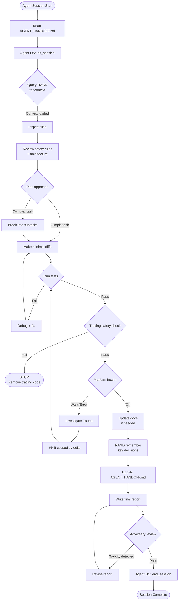
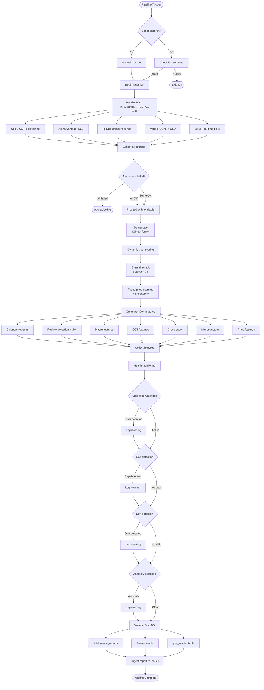
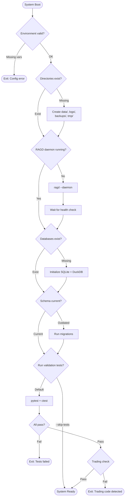
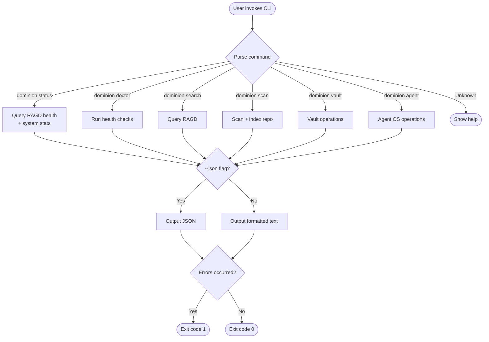
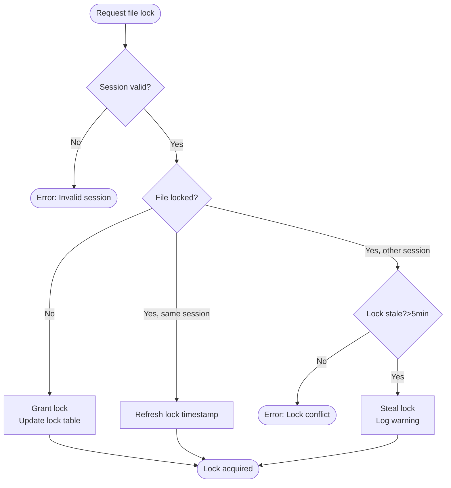

# Control Flow Architecture

**Purpose:** Control flow patterns for agent workflows, data processing, system initialization.

---

## Agent Workflow Control Flow

---

## Data Pipeline Control Flow

---

## System Initialization Control Flow

---

## CLI Command Control Flow

---

## Lock Acquisition Control Flow (Agent OS)

---

## Retrieval Hints

- "control flow"
- "workflow diagram"
- "agent workflow"
- "pipeline control flow"
- "system initialization"
