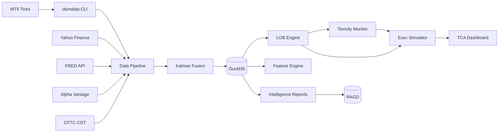
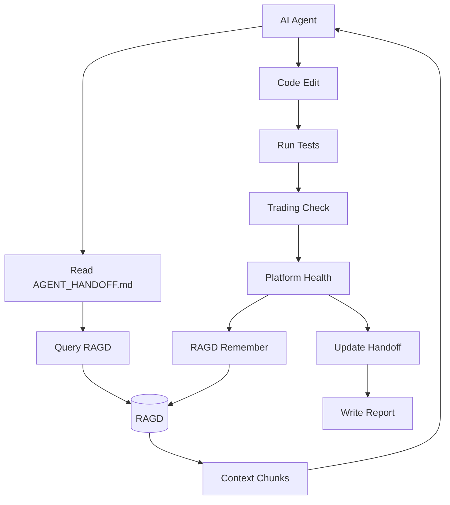
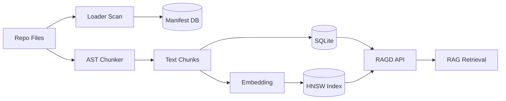

# Data Flow Architecture

## Primary Data Flows

### 1. Market Data Ingestion Flow

### 2. Agent Workflow Data Flow

### 3. RAGD Indexing Flow

## Data Stores

| Store | Technology | Purpose | Size (2026-05-19) |
|---|---|---|---|
| RAGD DB | SQLite + HNSW | Document chunks + embeddings | 8,760 total chunks |
| Manifest DB | SQLite | File hashes + metadata | ~1,300 files |
| Agent OS DB | SQLite | Sessions + tasks + locks | Active sessions vary |
| Data Pipeline DB | DuckDB | Market data + features | Growing daily |
| Microstructure DB | DuckDB | LOB + exec + TCA + toxicity | Growing daily |
| Vault | Markdown files | Knowledge graph | 878 notes |

## Data Retention

- **RAGD chunks:** Soft-delete when source file removed
- **Market data:** Indefinite retention (compressed)
- **Feature history:** Rolling 2-year window
- **Intelligence reports:** Indefinite retention
- **Agent session logs:** 90-day retention
- **Backups:** See backups/ folder

## Data Privacy

- **Secrets:** Never indexed, never committed, never printed
- **API keys:** Environment variables only
- **MT5 credentials:** `secrets/mt5.env` (excluded from all scans)
- **Personal data:** None collected
- **Trading data:** Read-only, no orders

## Data Validation

Every data source validates:
- Schema correctness
- Timestamp ordering
- Missing value handling
- Outlier detection (>5σ quarantine)
- Cross-source consistency (Byzantine FT)

## Retrieval Hints

Queries for this doc:
- "data flow"
- "how does data move through the system"
- "where does market data come from"
- "how does RAGD get populated"
- "what databases exist"
