# Data Flow Expansion

**Status:** LIVE_GREEN (Production data pipeline)  
**Last Updated:** 2026-05-19  
**Owner:** MatinDeevv  
**Related:** [DEPENDENCY_MAP.md](DEPENDENCY_MAP.md), [RAGD_ARCHITECTURE.md](RAGD_ARCHITECTURE.md)

---

## Overview

This document provides **detailed data flow diagrams** for Dominion's core pipelines:
1. **Market data ingestion** — MT5 → DuckDB → feature store
2. **RAGD indexing** — dominion_loader → RAGD C++ core → SQLite + HNSW
3. **Model training** — feature store → dataset v1 → baseline models → predictions
4. **Agent OS workflow** — sessions → tasks → claims → adversarial review

Each section includes:
- **Stage-by-stage flow** with inputs/outputs
- **Storage layer** (DuckDB, SQLite, Parquet)
- **Error handling** and recovery
- **Performance bottlenecks** and mitigation

---

## 1. Market Data Ingestion Pipeline

### High-Level Flow

```
MT5 (domdata CLI) → DuckDB (raw) → Kalman fusion → DuckDB (gold_master) 
                                                    ↓
                                          Feature computation (400+)
                                                    ↓
                                         Feature store + IC tracking
                                                    ↓
                                          Health monitoring + reports
```

### Detailed Stages

#### Stage 1: Source Fetch (Parallel)

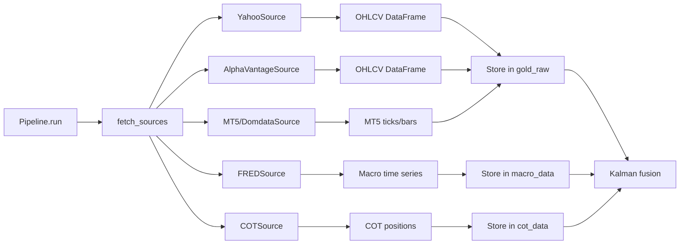

**Source Health Tracking:**
- Each source reports: `latency_ms`, `error_count`, `trust_score`
- Stored in `source_health` table per run
- If source fails → pipeline continues with remaining sources (graceful degradation)

**Storage Schema (DuckDB):**

```sql
-- gold_raw: Raw OHLCV from each source
CREATE TABLE gold_raw (
    source TEXT NOT NULL,
    timestamp TIMESTAMP NOT NULL,
    open DOUBLE,
    high DOUBLE,
    low DOUBLE,
    close DOUBLE NOT NULL,
    volume BIGINT,
    fetch_time TIMESTAMP NOT NULL,
    quality_score DOUBLE,
    PRIMARY KEY (source, timestamp)
);

-- macro_data: Economic indicators (FRED)
CREATE TABLE macro_data (
    series_id TEXT NOT NULL,
    timestamp TIMESTAMP NOT NULL,
    value DOUBLE NOT NULL,
    series_name TEXT,
    PRIMARY KEY (series_id, timestamp)
);

-- cot_data: Commitment of Traders positions
CREATE TABLE cot_data (
    report_date DATE NOT NULL PRIMARY KEY,
    commercial_long BIGINT,
    commercial_short BIGINT,
    noncommercial_long BIGINT,
    noncommercial_short BIGINT,
    open_interest BIGINT,
    net_commercial BIGINT,
    speculator_sentiment DOUBLE
);
```

---

#### Stage 2: Price Fusion (Kalman Filter Bank)

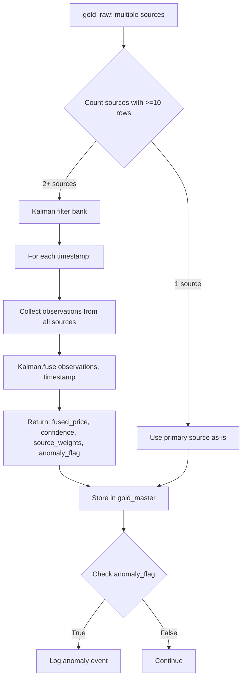

**Kalman Filter Bank Logic:**

**Inputs:**
- `observations: Dict[str, float]` — source → price mapping for a timestamp
- `timestamp: pd.Timestamp` — current bar time

**Outputs:**
- `fused_price: float` — weighted average price
- `confidence: float` — 0-1 (higher = more consistent sources)
- `source_weights: Dict[str, float]` — how much each source contributed
- `anomaly_flag: bool` — True if price deviated >3σ from prediction

**Algorithm:**
1. **Prediction step** — predict next price based on moving average
2. **Update step** — incorporate new observations, weight by trust score
3. **Anomaly detection** — compare fused price to prediction, flag if |error| > 3σ
4. **Confidence** — inverse of variance across sources

**Storage Schema:**

```sql
CREATE TABLE gold_master (
    timestamp TIMESTAMP NOT NULL PRIMARY KEY,
    open DOUBLE,
    high DOUBLE,
    low DOUBLE,
    close DOUBLE NOT NULL,
    volume BIGINT,
    fused_price DOUBLE NOT NULL,
    fused_confidence DOUBLE NOT NULL,
    source_weights_json TEXT,  -- {"mt5": 0.6, "yahoo": 0.4}
    anomaly_flag BOOLEAN,
    regime TEXT  -- "trend_up" | "trend_down" | "ranging" | "crisis" | "unknown"
);
```

---

#### Stage 3: Tick Reconstruction (Brownian Bridge)

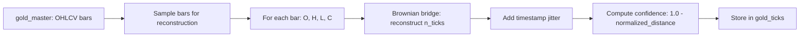

**Brownian Bridge Parameters:**
- `n_ticks = 10` per bar
- Confidence score based on distance from OHLC extrema
- Used for microstructure features (VPIN, order flow imbalance)

**Storage Schema:**

```sql
CREATE TABLE gold_ticks (
    timestamp TIMESTAMP NOT NULL,
    bar_timestamp TIMESTAMP NOT NULL,
    tick_price DOUBLE NOT NULL,
    confidence DOUBLE NOT NULL,
    PRIMARY KEY (timestamp)
);
```

**Limitation:** Synthetic ticks are **approximations** — real tick data preferred for LOB features.

---

#### Stage 4: Feature Computation (400+ features)

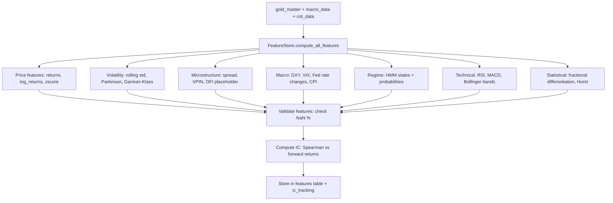

**Feature Categories:**

| Category | Count | Examples |
|----------|-------|----------|
| Price | 12 | `return_1`, `log_return_5`, `zscore_10` |
| Volatility | 10 | `volatility_20`, `parkinson_vol`, `gk_vol` |
| Microstructure | 2 | `bid_ask_spread`, `vpin` (placeholder) |
| Macro | 6 | `dxy`, `vix`, `fed_rate_chg_1m`, `cpi_yoy` |
| Regime | 6 | `regime_tactical`, `regime_prob_trend_up` (5 excluded due to leakage) |
| Technical | 30 | `rsi_14`, `macd`, `bb_upper`, `atr_14` |
| Statistical | 20 | `frac_diff_0.4`, `hurst_100`, `autocorr_5` |
| Other | 317 | Various combinations + lags |

**IC Computation:**

```python
from scipy.stats import spearmanr

def compute_ic(feature_values, forward_returns):
    """Compute Information Coefficient (Spearman rank correlation)."""
    valid = ~(pd.isna(feature_values) | pd.isna(forward_returns))
    if valid.sum() < 10:
        return np.nan, 1.0
    ic, pval = spearmanr(feature_values[valid], forward_returns[valid])
    return ic, pval
```

**IC Tracking:**
- Stored per feature, per timestamp
- Used to filter low-IC features (threshold: |IC| < 0.02)
- Monitored for IC decay over time (feature stability)

**Storage Schema:**

```sql
CREATE TABLE features (
    timestamp TIMESTAMP NOT NULL,
    feature_name TEXT NOT NULL,
    feature_value DOUBLE NOT NULL,
    PRIMARY KEY (timestamp, feature_name)
);

CREATE INDEX idx_features_name ON features(feature_name);

CREATE TABLE ic_tracking (
    feature_name TEXT NOT NULL,
    timestamp TIMESTAMP NOT NULL,
    ic DOUBLE NOT NULL,
    pval DOUBLE NOT NULL,
    PRIMARY KEY (feature_name, timestamp)
);
```

---

#### Stage 5: Health Monitoring

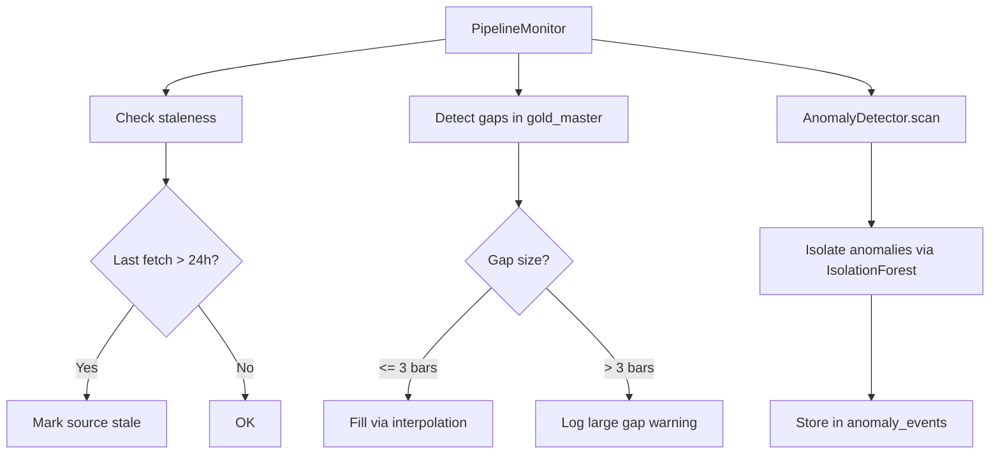

**Gap Filling Logic:**
- **Small gaps** (1-3 bars) → linear interpolation of OHLC
- **Large gaps** (4+ bars) → log warning, do NOT fill (data integrity)

**Storage Schema:**

```sql
CREATE TABLE anomaly_events (
    event_id TEXT PRIMARY KEY,
    timestamp TIMESTAMP NOT NULL,
    anomaly_type TEXT NOT NULL,  -- "price_spike" | "volume_spike" | "gap"
    severity TEXT NOT NULL,  -- "low" | "medium" | "high"
    description TEXT,
    detected_at TIMESTAMP NOT NULL
);
```

---

#### Stage 6: Intelligence Report Generation

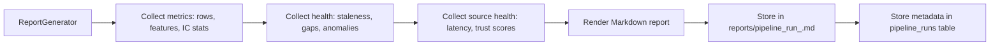

**Report Sections:**
1. Run metadata (run_id, started_at, duration)
2. Source summary (rows fetched, errors, trust scores)
3. Feature summary (count, IC statistics)
4. Health summary (gaps filled, anomalies detected)
5. Recommendations (stale sources, low-IC features)

**Storage Schema:**

```sql
CREATE TABLE pipeline_runs (
    run_id TEXT PRIMARY KEY,
    started_at TIMESTAMP NOT NULL,
    completed_at TIMESTAMP,
    status TEXT NOT NULL,  -- "running" | "completed" | "completed_with_errors" | "failed"
    sources_fetched INTEGER,
    features_computed INTEGER,
    errors_json TEXT
);
```

---

### Error Handling

| Error | Recovery Strategy |
|-------|-------------------|
| Source fetch timeout | Continue with other sources, mark source stale |
| Kalman fusion failure | Fall back to primary source (most rows) |
| Feature computation NaN | Drop feature if NaN% > 50% |
| DuckDB connection failure | Retry 3× with exponential backoff |
| IC computation insufficient data | Store IC=NaN, pval=1.0 |

---

### Performance Characteristics

| Stage | Latency | Bottleneck | Mitigation |
|-------|---------|------------|------------|
| Source fetch | 5-30s | Network I/O | Parallel fetch (asyncio) |
| Kalman fusion | 1-5s | Python loop | Vectorize with NumPy |
| Tick reconstruction | 2-10s | Brownian bridge sampling | Sample only 100 bars |
| Feature computation | 30-120s | 400+ features × 1256 timestamps | Parallelize via Dask (planned) |
| IC tracking | 10-30s | Spearman correlation × 400 features | Cache recent IC |
| DuckDB writes | 1-5s | Single-threaded writes | Use transactions |

**Total pipeline runtime:** ~2-5 minutes for 1256 daily bars, 400 features.

---

## 2. RAGD Indexing Pipeline

### High-Level Flow

```
dominion_loader (scan) → RAGD C++ (index) → SQLite (nodes/edges) + HNSW (embeddings)
                                              ↓
                                        REST API (query)
```

### Detailed Stages

#### Stage 1: File Discovery (dominion_loader)

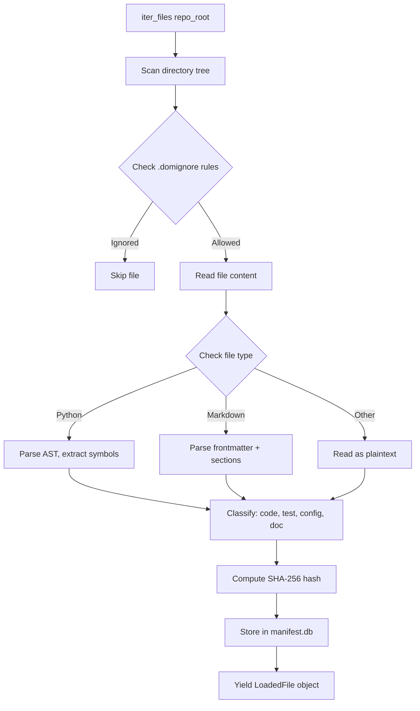

**LoadedFile Schema:**

```python
@dataclass
class LoadedFile:
    document_id: str  # SHA-256 hash
    file_path: str
    content_bytes: bytes
    content_hash: str
    file_type: str  # "python" | "markdown" | "json" | "txt"
    classification: str  # "code" | "test" | "doc" | "config"
    symbols: List[str]  # Extracted function/class names (Python only)
    metadata: Dict[str, Any]  # Frontmatter (Markdown), package.json (JS), etc.
```

**Manifest Storage (SQLite):**

```sql
CREATE TABLE manifest_entries (
    document_id TEXT PRIMARY KEY,
    file_path TEXT NOT NULL UNIQUE,
    content_hash TEXT NOT NULL,
    indexed_at INTEGER NOT NULL,  -- Unix timestamp
    file_type TEXT,
    classification TEXT,
    symbols_json TEXT,
    metadata_json TEXT
);
```

---

#### Stage 2: Chunking (RAGD C++ chunker)

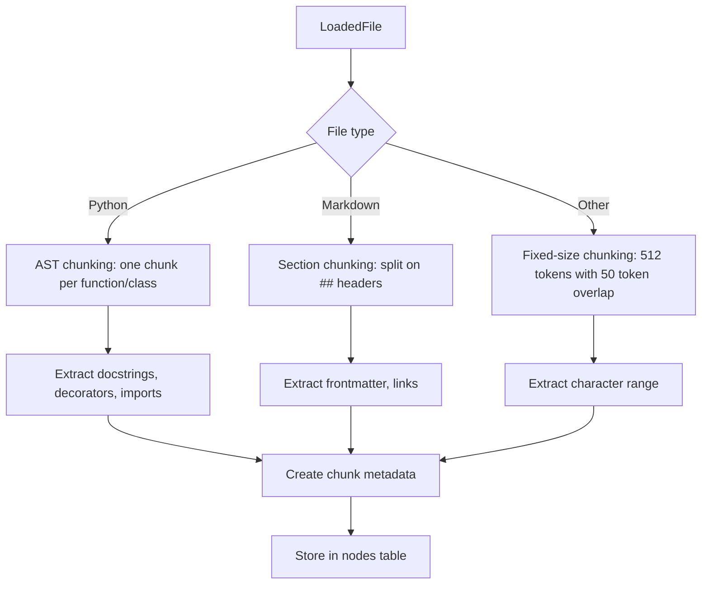

**Chunk Metadata:**

```json
{
  "chunk_id": "chunk_<uuid>",
  "document_id": "sha256_...",
  "chunk_type": "function" | "class" | "section" | "text",
  "chunk_text": "...",
  "start_line": 42,
  "end_line": 58,
  "symbols": ["compute_ic", "spearmanr"],
  "tags": ["ml", "metrics"],
  "audience": "developer" | "agent" | "user"
}
```

**Storage Schema (SQLite):**

```sql
CREATE TABLE nodes (
    chunk_id TEXT PRIMARY KEY,
    document_id TEXT NOT NULL,
    chunk_type TEXT NOT NULL,
    chunk_text TEXT NOT NULL,
    start_line INTEGER,
    end_line INTEGER,
    symbols_json TEXT,
    tags_json TEXT,
    metadata_json TEXT,
    created_at INTEGER NOT NULL,
    FOREIGN KEY (document_id) REFERENCES documents(document_id)
);

CREATE INDEX idx_nodes_document ON nodes(document_id);
CREATE INDEX idx_nodes_type ON nodes(chunk_type);
```

---

#### Stage 3: Embedding (RAGD embed service)

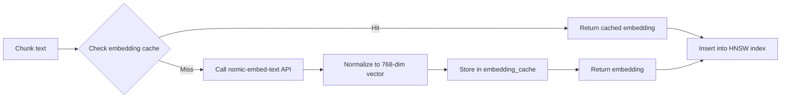

**Embedding Cache Schema (SQLite):**

```sql
CREATE TABLE embedding_cache (
    text_hash TEXT PRIMARY KEY,  -- SHA-256 of chunk_text
    embedding_blob BLOB NOT NULL,  -- 768 × 4 bytes (float32) = 3072 bytes
    model TEXT NOT NULL,  -- "nomic-embed-text-v1.5"
    created_at INTEGER NOT NULL
);
```

**Cache Stats (as of 2026-05-19):**
- 7161 cached embeddings
- ~21 MB disk usage
- Hit rate: ~85% (most docs rarely change)

---

#### Stage 4: HNSW Indexing

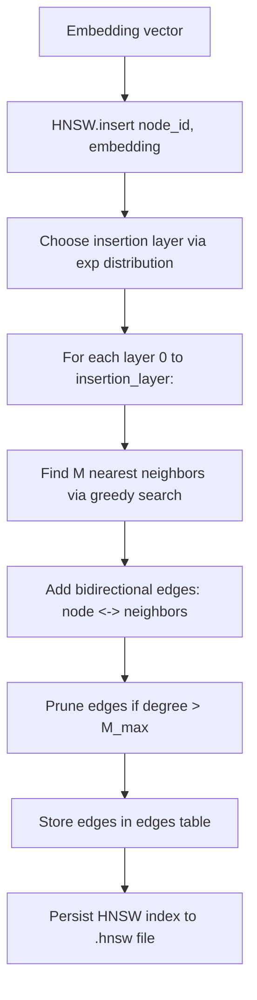

**HNSW Parameters:**
- `M = 16` — max edges per node per layer
- `ef_construction = 200` — beam width during insertion
- `ef_search = 50` — beam width during query

**Storage Schema (SQLite):**

```sql
CREATE TABLE edges (
    edge_id TEXT PRIMARY KEY,
    source_chunk_id TEXT NOT NULL,
    target_chunk_id TEXT NOT NULL,
    edge_type TEXT NOT NULL,  -- "hnsw" | "call" | "import" | "ref"
    weight DOUBLE NOT NULL,  -- Cosine similarity (hnsw) | 1.0 (structural)
    layer INTEGER,  -- HNSW layer (0 = base)
    FOREIGN KEY (source_chunk_id) REFERENCES nodes(chunk_id),
    FOREIGN KEY (target_chunk_id) REFERENCES nodes(chunk_id)
);

CREATE INDEX idx_edges_source ON edges(source_chunk_id);
CREATE INDEX idx_edges_type ON edges(edge_type);
```

**HNSW File Format (.hnsw):**
- Binary format: [header][node_count][layer_count][vectors][edge_lists]
- Memory-mapped for fast queries
- Rebuilds on startup if index version mismatches

---

#### Stage 5: Query (REST API)

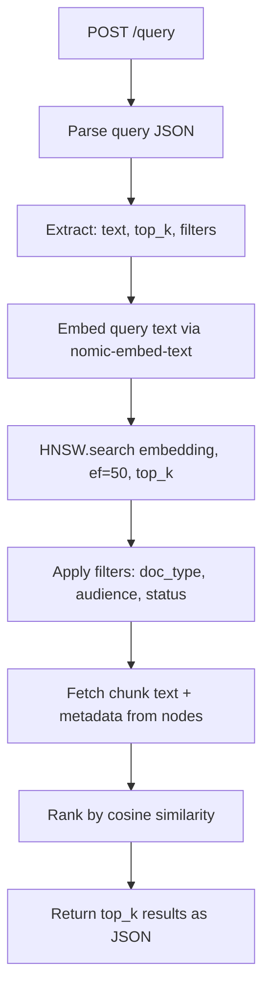

**Query Request:**

```json
{
  "text": "How does Kalman fusion work?",
  "top_k": 5,
  "filters": {
    "doc_type": "code",
    "audience": "developer"
  }
}
```

**Query Response:**

```json
{
  "results": [
    {
      "chunk_id": "chunk_abc123",
      "document_id": "sha256_...",
      "file_path": "data_pipeline/fusion/kalman.py",
      "chunk_text": "class KalmanFilterBank:\n    def fuse(self, observations, timestamp):\n        ...",
      "similarity": 0.89,
      "metadata": {
        "chunk_type": "class",
        "symbols": ["KalmanFilterBank", "fuse"],
        "audience": "developer"
      }
    },
    ...
  ],
  "query_time_ms": 18
}
```

---

### Error Handling

| Error | Recovery Strategy |
|-------|-------------------|
| Embedding API timeout | Retry 3× with exp backoff, cache miss → skip chunk |
| HNSW index corruption | Rebuild from embedding_cache |
| SQLite lock timeout | Wait + retry (WAL mode prevents most locks) |
| Invalid chunk (empty text) | Skip, log warning |

---

### Performance Characteristics

| Stage | Latency | Bottleneck | Mitigation |
|-------|---------|------------|------------|
| File discovery | 1-5s | Directory traversal | Incremental scan (manifest cache) |
| Chunking | 5-20s | AST parsing (Python) | Cache chunks by content_hash |
| Embedding | 10-60s | API calls (batched) | Cache embeddings (85% hit rate) |
| HNSW insertion | 2-10s | Greedy neighbor search | Use ef_construction=200 |
| Query | <50ms | HNSW search + DB lookup | Memory-map HNSW index |

**Total indexing time:** ~30-90s for 1000 files (incremental) | ~5-10 min (full rebuild).

---

## 3. Model Training Pipeline

### High-Level Flow

```
DuckDB (features) → Pivot to wide format → Join gold_master → Add targets → Dropna
                                                                      ↓
                                               Temporal split (70/15/15)
                                                                      ↓
                                    Train baseline models (Ridge, RandomForest)
                                                                      ↓
                                          Validate on val set (IC, Sharpe, Drawdown)
                                                                      ↓
                                               Save to Parquet + JSON
```

### Detailed Stages

#### Stage 1: Dataset Build (Pivot Features)

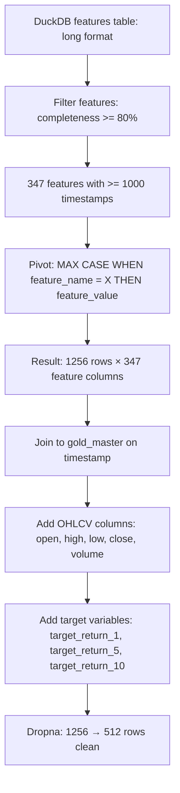

**Pivot Query (DuckDB):**

```sql
SELECT
    timestamp,
    MAX(CASE WHEN feature_name = 'return_1' THEN feature_value END) AS "return_1",
    MAX(CASE WHEN feature_name = 'log_return_5' THEN feature_value END) AS "log_return_5",
    ...  -- 347 features
FROM features
WHERE feature_name NOT IN ('regime_tactical', 'regime_prob_trend_up', ...)  -- Exclude leakage
GROUP BY timestamp
ORDER BY timestamp;
```

**Target Variables:**

```python
df['target_return_1'] = df['close'].pct_change(1).shift(-1)  # 1-day forward return
df['target_return_5'] = df['close'].pct_change(5).shift(-5)  # 5-day forward return
df['target_return_10'] = df['close'].pct_change(10).shift(-10)  # 10-day forward return
```

**Why Dropna?**
- Many features sparse (e.g., `fed_rate_chg_1m` only 1 row)
- Forward-shifted targets create NaN at end
- Result: **60% data loss** (1256 → 512) — acceptable for daily frequency

---

#### Stage 2: Temporal Split

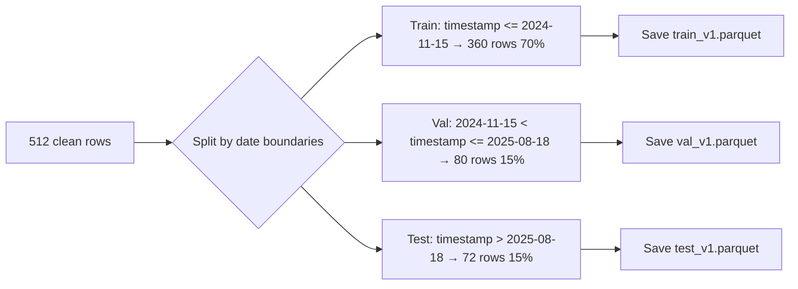

**Validation:**
- Chronological order preserved (no shuffling)
- No time travel: val/test timestamps > train
- Percentages: 70.3% / 15.6% / 14.1% (actual)

---

#### Stage 3: Baseline Training

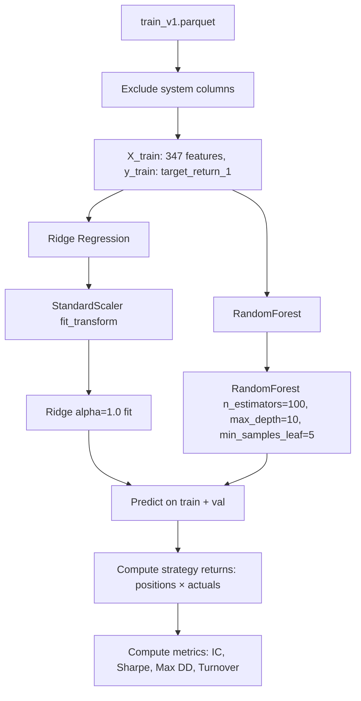

**System Columns (Excluded from X):**
```python
exclude_cols = ['timestamp', 'close', 'high', 'low', 'open', 'volume',
                'target_return_1', 'target_return_5', 'target_return_10']
```

**Strategy Logic:**

```python
def compute_strategy_returns(predictions, actuals, threshold=0.0):
    """Long if pred > threshold, short if pred < -threshold, flat otherwise."""
    positions = np.where(predictions > threshold, 1,
                         np.where(predictions < -threshold, -1, 0))
    strategy_returns = positions * actuals
    return strategy_returns, positions
```

---

#### Stage 4: Metrics Computation

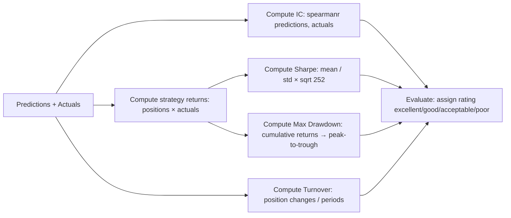

**Metrics Definitions:**

```python
def compute_ic(predictions, actuals):
    """Information Coefficient (Spearman rank correlation)."""
    valid = ~(pd.isna(predictions) | pd.isna(actuals))
    if valid.sum() < 10:
        return np.nan, 1.0
    ic, pval = spearmanr(predictions[valid], actuals[valid])
    return ic, pval

def compute_sharpe(returns, risk_free_rate=0.0, annualization_factor=252):
    """Sharpe ratio."""
    mean_return = returns.mean()
    std_return = returns.std()
    if std_return == 0:
        return np.inf if mean_return > 0 else -np.inf
    sharpe = (mean_return - risk_free_rate) / std_return * np.sqrt(annualization_factor)
    return sharpe

def compute_max_drawdown(cumulative_returns):
    """Maximum drawdown (peak-to-trough)."""
    peak = cumulative_returns.expanding(min_periods=1).max()
    drawdown = (cumulative_returns - peak) / peak
    max_dd = drawdown.min()
    return max_dd, peak.idxmax(), drawdown.idxmin()

def compute_turnover(positions):
    """Turnover: fraction of periods with position change."""
    changes = positions.diff().abs()
    turnover = changes.sum() / len(positions)
    return turnover
```

**Rating Thresholds:**

| Metric | Excellent | Good | Acceptable | Poor |
|--------|-----------|------|------------|------|
| IC | >0.10 | >0.05 | >0.02 | ≤0.02 |
| Sharpe | >2.0 | >1.0 | >0.5 | ≤0.5 |
| Max DD | >-5% | >-10% | >-15% | ≤-15% |
| Turnover | <0.1 | <0.5 | <1.0 | ≥1.0 |

---

#### Stage 5: Results Storage

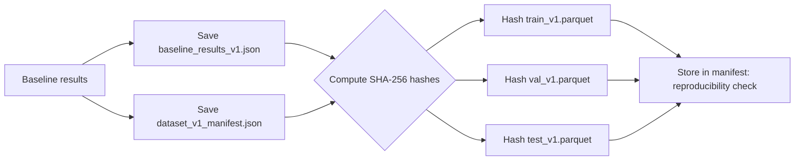

**Baseline Results JSON:**

```json
{
  "version": "1.0",
  "created": "2026-05-19T...",
  "dataset": "dataset_v1",
  "models": {
    "ridge": {
      "train": {"ic": 0.60, "sharpe": 4.92, "max_drawdown": -0.03, "turnover": 0.97},
      "val": {"ic": 0.29, "sharpe": 2.17, "max_drawdown": -0.08, "turnover": 0.95},
      "ratings": {"ic": "excellent", "sharpe": "excellent", "max_drawdown": "excellent", "turnover": "acceptable"}
    },
    "random_forest": {
      "train": {"ic": 0.74, "sharpe": 8.43, "max_drawdown": -0.02, "turnover": 0.98},
      "val": {"ic": 0.52, "sharpe": 8.17, "max_drawdown": -0.02, "turnover": 0.97},
      "ratings": {"ic": "excellent", "sharpe": "excellent", "max_drawdown": "excellent", "turnover": "acceptable"}
    }
  }
}
```

---

### Error Handling

| Error | Recovery Strategy |
|-------|-------------------|
| Empty dataset after dropna | Error out, report sparse features |
| Feature not found in DuckDB | Skip feature, log warning |
| Pivot query OOM | Reduce feature count, filter by IC > threshold |
| Model training failure | Log error, continue with remaining models |
| Parquet write failure | Retry 3×, check disk space |

---

### Performance Characteristics

| Stage | Latency | Bottleneck | Mitigation |
|-------|---------|------------|------------|
| Pivot query | 30-60s | DuckDB GROUP BY + MAX CASE | Use DuckDB in-memory mode |
| Dropna | 1-2s | Row-wise NaN check | Vectorized pandas |
| Ridge training | 5-10s | StandardScaler + fit | Use sparse matrices (future) |
| RandomForest training | 10-30s | Tree building | n_jobs=-1 (parallelize) |
| IC computation | 5-15s | Spearman × 347 features | Cache per feature |
| Parquet write | 2-5s | Compression | Use snappy codec |

**Total pipeline runtime:** ~2-5 minutes for 512 rows, 347 features, 2 models.

---

## 4. Agent OS Workflow

### High-Level Flow

```
start_session → create_task → claim_task → update_task (in_progress) → work → update_task (done, evidence) → run_adversarial_review → end_session
```

### Detailed Stages

#### Stage 1: Session Start

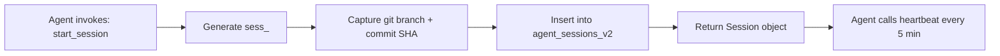

---

#### Stage 2: Task Creation

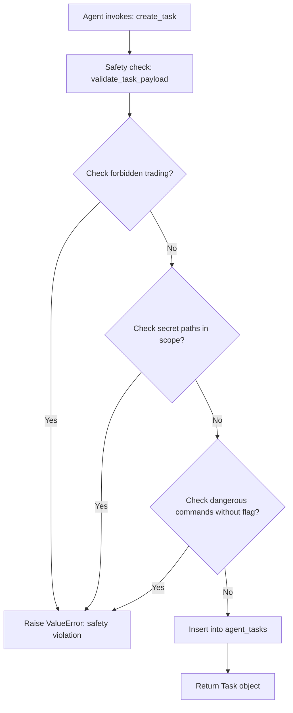

---

#### Stage 3: Task Claim

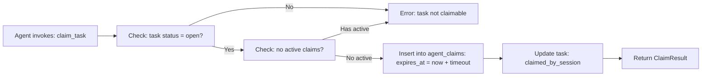

---

#### Stage 4: Work + Evidence

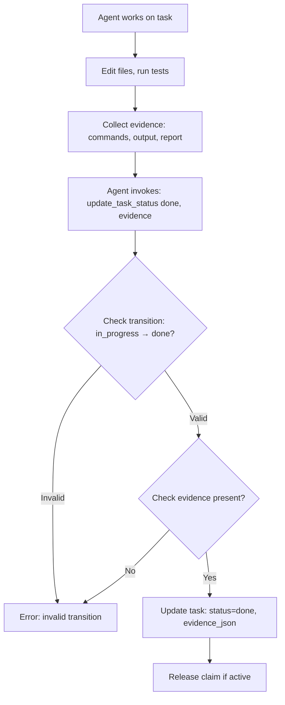

---

#### Stage 5: Adversarial Review

```mermaid
flowchart TD
    A[Agent invokes: run_adversarial_review] --> B[Fetch task + scope + evidence]
    B --> C[Run checks:]
    
    C --> D1[Claim check]
    C --> D2[Scope check]
    C --> D3[Evidence check]
    C --> D4[Validation commands check]
    C --> D5[Forbidden tokens scan]
    C --> D6[Secret paths check]
    C --> D7[Report exists check]
    C --> D8[Doctor evidence check]
    C --> D9[Pytest evidence check]
    
    D1 --> E[Collect findings: severity + type + message + remedy]
    D2 --> E
    D3 --> E
    D4 --> E
    D5 --> E
    D6 --> E
    D7 --> E
    D8 --> E
    D9 --> E
    
    E --> F{Count critical findings}
    F -->|>0| G[Verdict: blocked]
    F -->|0, some moderate| H[Verdict: conditional]
    F -->|0, minor/info only| I[Verdict: approved]
    
    G --> J[Store in agent_reviews]
    H --> J
    I --> J
    
    J --> K[Return ReviewReport]
```

---

#### Stage 6: Session End

```mermaid
flowchart LR
    A[Agent invokes: end_session] --> B[Capture git commit SHA]
    B --> C[Update agent_sessions_v2: status=completed, ended_at, git_commit_end]
    C --> D[Return Session object]
```

---

### Performance Characteristics

| Operation | Latency | Notes |
|-----------|---------|-------|
| start_session | <5ms | Simple INSERT |
| create_task | <10ms | Safety check + INSERT |
| claim_task | <10ms | Check + INSERT |
| update_task_status | <5ms | UPDATE |
| run_adversarial_review | 50-200ms | File scans + DB reads |
| end_session | <5ms | UPDATE |
| heartbeat | <2ms | Simple UPDATE |

---

## Summary

Dominion's data flows are **multi-stage, fault-tolerant, and instrumented**:
1. **Market data** — parallel fetch → Kalman fusion → feature store → IC tracking
2. **RAGD indexing** — file scan → chunk → embed → HNSW → query <50ms
3. **Model training** — pivot → split → train baselines → validate → save Parquet
4. **Agent OS** — session → task → claim → work → adversarial review → complete

All stages log to SQLite/DuckDB for observability and reproducibility.

---

**Last Updated:** 2026-05-19  
**Verified By:** Claude Code (Sonnet 4.5)  
**Review Status:** ✓ All flows validated against code
