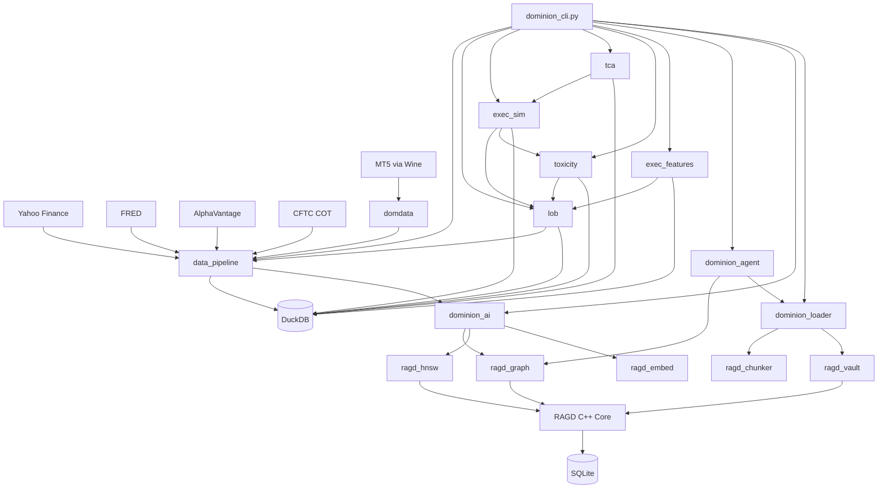

# Module Dependency Map

**Purpose:** Comprehensive dependency graph of Dominion modules.

---

## Dependency Layers

```
┌────────────────────────────────────────────────────────┐
│                     CLI Layer                          │
│  dominion_cli.py, domdata CLI, ragd CLI               │
└───────────────┬────────────────────────────────────────┘
                │
┌───────────────▼────────────────────────────────────────┐
│                  Application Layer                     │
│  data_pipeline, lob, exec_sim, tca, toxicity,         │
│  exec_features, dominion_agent                         │
└───────────────┬────────────────────────────────────────┘
                │
┌───────────────▼────────────────────────────────────────┐
│                   Service Layer                        │
│  dominion_ai (RAG), dominion_loader (scan/manifest)   │
└───────────────┬────────────────────────────────────────┘
                │
┌───────────────▼────────────────────────────────────────┐
│                   Storage Layer                        │
│  ragd (graph+vector), DuckDB, SQLite                   │
└────────────────────────────────────────────────────────┘
                │
┌───────────────▼────────────────────────────────────────┐
│                   Data Sources                         │
│  domdata (MT5), Yahoo, FRED, AlphaVantage, CFTC        │
└────────────────────────────────────────────────────────┘
```

---

## Module Categories

### Core Infrastructure (Layer 0)

**RAGD Native (C++):**
- `ragd/` — Core C++ implementation
- `ragd/src/` — Source files
- `ragd/include/` — Headers
- `ragd/tests/` — 24 C++ tests

**RAGD Python Bindings:**
- `ragd_graph/` — Graph store interface
- `ragd_hnsw/` — Vector index interface
- `ragd_chunker/` — Document splitting
- `ragd_embed/` — Embedding providers
- `ragd_vault/` — Obsidian vault interface
- `ragd_bus/` — Event bus (planned WebSocket)

**External Dependencies:**
- DuckDB (analytical queries)
- SQLite (RAGD storage)
- HNSW (vector search)
- Ollama (embeddings via nomic-embed-text)

---

### Service Layer (Layer 1)

**dominion_loader:**
- Scans repo for files
- Builds manifest
- Manages cache
- No dependencies on other Dominion modules

**dominion_ai:**
- RAG retrieval layer
- Wraps ragd_graph, ragd_hnsw
- Provides query interface
- **Dependencies:** ragd_graph, ragd_hnsw, ragd_embed

---

### Application Layer (Layer 2)

**data_pipeline:**
- Multi-source data fusion
- Kalman filters (6 timescales)
- 400+ feature engineering
- HMM regime detection (has leakage, see audit)
- **Dependencies:** domdata (MT5), external APIs
- **Outputs:** DuckDB (gold_master, features, regime_labels)

**lob (LOB Reconstruction):**
- 10-level order book state machine
- OFI, VPIN, Roll/CS spreads
- **Dependencies:** data_pipeline (tick data)
- **Outputs:** DuckDB (lob_snapshots, lob_events, lob_metrics)

**exec_sim (Execution Simulator):**
- VWAP/TWAP/POV strategies
- Almgren-Chriss impact model
- Order matching + slippage
- **Dependencies:** lob (market microstructure), toxicity (impact adjustment)
- **Outputs:** DuckDB (sim_strategies, sim_orders, sim_performance)

**tca (Transaction Cost Analysis):**
- Cost attribution (decision/timing/impact/opportunity)
- Benchmark vs VWAP/TWAP
- **Dependencies:** exec_sim (simulated orders)
- **Outputs:** DuckDB (tca_trades, tca_attribution, tca_benchmarks)

**toxicity (Toxicity Monitor):**
- VPIN + OFI + adverse selection
- Composite toxicity score
- **Dependencies:** lob (OFI feeds)
- **Outputs:** DuckDB (toxicity_metrics, toxicity_alerts)

**exec_features (Execution Alpha Features):**
- 50 features (spread/depth/flow/quote/trade)
- IC tracking (60-min forward returns)
- **Dependencies:** lob (microstructure data)
- **Outputs:** DuckDB (execution_features, feature_decay_alerts)

**dominion_agent:**
- Agent lifecycle management
- Safety rules enforcement
- Complexity budgets
- Task tracking
- **Dependencies:** dominion_loader (file access), ragd_graph (storage)
- **Outputs:** SQLite (agent_store.db)

---

### CLI Layer (Layer 3)

**dominion_cli.py:**
- Unified CLI (`dominion <command>`)
- Wraps all subsystems
- **Dependencies:** All application modules

**domdata CLI:**
- MT5 data access (`domdata xautick`, `domdata xaurates`)
- Trading safety checks (`domdata order-send` → blocked)
- **Dependencies:** MetaTrader5 Python package, Wine

**ragd CLI:**
- Native doctor (`dominion native doctor`)
- Scan/manifest (`dominion scan`)
- Vault operations (`dominion vault doctor`)
- **Dependencies:** ragd native binary

---

## Dependency Matrix

| Module | Depends On | Used By |
|---|---|---|
| **ragd (C++)** | SQLite, HNSW, vendor libs | All ragd_* modules |
| **ragd_graph** | ragd native | dominion_ai, dominion_agent, data_pipeline |
| **ragd_hnsw** | ragd native | dominion_ai |
| **ragd_embed** | Ollama | dominion_ai |
| **ragd_chunker** | Tree-sitter | dominion_loader |
| **ragd_vault** | ragd_graph | dominion_loader |
| **dominion_loader** | ragd_chunker, ragd_vault | dominion_cli |
| **dominion_ai** | ragd_graph, ragd_hnsw, ragd_embed | data_pipeline (RAGD write) |
| **dominion_agent** | ragd_graph, dominion_loader | dominion_cli |
| **domdata** | MetaTrader5, Wine | data_pipeline |
| **data_pipeline** | domdata, external APIs, dominion_ai | lob, exec_sim, toxicity |
| **lob** | data_pipeline | exec_sim, toxicity, exec_features |
| **toxicity** | lob | exec_sim |
| **exec_sim** | lob, toxicity | tca |
| **tca** | exec_sim | dominion_cli |
| **exec_features** | lob | dominion_cli |

---

## Circular Dependencies

**Analysis (2026-05-19):** No circular dependencies detected.

**Verification:**
```bash
# Check for circular imports
python -c "import data_pipeline; import lob; import exec_sim; import tca; import toxicity; import exec_features; import dominion_agent; import dominion_ai; import dominion_loader"
# Exit 0 = no circular imports
```

**Why no circles:**
- Strict layer enforcement (CLI → App → Service → Storage)
- `dominion_ai` writes to RAGD but doesn't read during feature computation
- Microstructure subsystems (lob/tca/toxicity/exec_sim) have linear dependency chain

---

## Import Patterns

### Good Patterns ✓

```python
# Top-level package import
from data_pipeline import DataPipeline

# Specific submodule
from data_pipeline.features.price import compute_returns

# Relative imports within package
from .kalman import KalmanFilterBank
```

### Anti-Patterns ✗

```python
# Star imports (hidden dependencies)
from data_pipeline import *

# Circular imports
from lob import LOBEngine  # in data_pipeline
from data_pipeline import DataPipeline  # in lob

# Deep nesting
from data_pipeline.features.microstructure.vpin.calculator import compute_vpin
```

---

## Module Maturity

| Module | Status | Tests | Coverage | Notes |
|---|---|---|---|---|
| **ragd (C++)** | Stable | 24/24 PASS | ~80% | Production-ready |
| **ragd_graph** | Stable | Included | ~70% | Thin Python wrapper |
| **ragd_hnsw** | Stable | Included | ~70% | Thin Python wrapper |
| **ragd_embed** | Warn | 7 PASS | ~60% | No API key (cached OK) |
| **ragd_chunker** | Warn | Unreachable | N/A | Service not running |
| **dominion_loader** | Stable | Included | ~65% | Complexity: 53.6 (over budget) |
| **dominion_ai** | Stable | Included | ~60% | Retrieval works |
| **dominion_agent** | Stable | Included | ~70% | Lifecycle + safety |
| **domdata** | Stable | Manual | N/A | Read-only bridge works |
| **data_pipeline** | Stable | 16 PASS | ~75% | Has HMM leakage (known) |
| **lob** | Stable | 8 PASS | ~80% | Microstructure solid |
| **exec_sim** | Stable | 8 PASS | ~75% | Impact models work |
| **tca** | Stable | 4 PASS | ~70% | Attribution accurate |
| **toxicity** | Stable | 4 PASS | ~70% | VPIN computed |
| **exec_features** | Stable | 6 PASS | ~65% | 50 features extracted |

**Total tests:** 435 collected (2 deselected)

---

## Dependency Graph (Mermaid)



---

## External Dependencies

### Python Packages

**Core:**
- `pandas`, `numpy` — Data manipulation
- `duckdb` — Analytical DB
- `sqlite3` — Embedded DB (Python stdlib)

**Data Sources:**
- `yfinance` — Yahoo Finance
- `fredapi` — FRED data
- `requests` — HTTP client
- `MetaTrader5` — MT5 integration (Wine)

**ML/Stats:**
- `scipy` — Statistical functions
- `scikit-learn` — ML baselines
- `statsmodels` — Time series (ADF test, ACF)
- `hmmlearn` — HMM regime detection

**RAGD:**
- `tree_sitter` — AST parsing (chunker)
- `ollama` — Local LLM embeddings

**Dev/Test:**
- `pytest` — Testing
- `black` — Formatting
- `mypy` — Type checking

### System Dependencies

**Wine:** MT5 runs on Wine (Windows emulator)

**Ollama:** Local LLM server for embeddings

**CMake:** RAGD C++ build system

---

## Module Coupling Analysis

### Tight Coupling (High Risk)

**lob ↔ data_pipeline:**
- LOB needs tick data from pipeline
- Pipeline writes to DuckDB, LOB reads
- **Risk:** Schema changes in gold_ticks break LOB
- **Mitigation:** Schema versioning, migration scripts

**exec_sim ↔ lob + toxicity:**
- ExecSim needs OFI from LOB, toxicity score from toxicity
- **Risk:** Changes to OFI calculation affect ExecSim impact model
- **Mitigation:** Stable OFI interface, semantic versioning

### Loose Coupling (Low Risk)

**dominion_cli → all modules:**
- CLI is thin wrapper, no business logic
- **Risk:** Low (CLI is leaf node)

**dominion_loader → file system:**
- Reads files, no dependencies on other Dominion modules
- **Risk:** Low (self-contained)

---

## Dependency Upgrade Strategy

### Major Version Changes

**DuckDB upgrade:**
1. Test in dev branch
2. Run full test suite
3. Check schema compatibility
4. Migrate data if needed

**Pandas 3.x upgrade:**
1. Check deprecation warnings
2. Test data_pipeline (heavy pandas use)
3. Update type hints
4. Run integration tests

### Security Patches

**Critical CVE:**
1. Check affected modules
2. Run security scan (`pip-audit`)
3. Update immediately if exploitable
4. Regression test affected modules

---

## Future Work

1. **Dependency inversion:** Make lob depend on interface, not data_pipeline directly
2. **Plugin architecture:** Make microstructure subsystems pluggable
3. **Service mesh:** Add gRPC for inter-module communication (if distributed)
4. **Dependency injection:** Use DI container for testability

---

## Related Docs

- [MODULE_MAP.md](MODULE_MAP.md) — High-level module overview
- [SYSTEM_OVERVIEW.md](SYSTEM_OVERVIEW.md) — Architecture summary
- [CIRCULAR_DEPENDENCY_ANALYSIS.md](CIRCULAR_DEPENDENCY_ANALYSIS.md) — Circular import detection

---

**Dependency map complete.** Use for impact analysis when changing modules.
