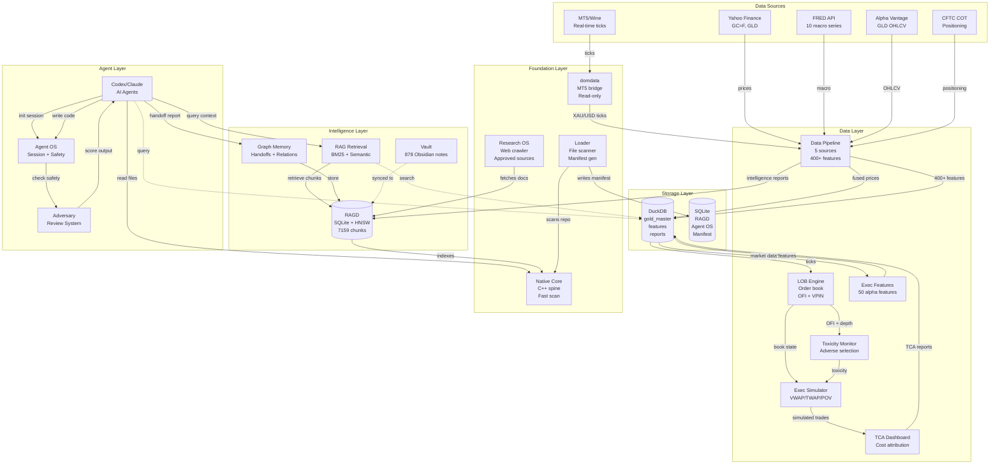

# Dominion System Architecture

See [00_START_HERE/OVERVIEW.md](../00_START_HERE/OVERVIEW.md) for complete system overview.

This doc focuses on architectural design principles and high-level structure.

## Architectural Principles

1. **Local-first:** No cloud dependencies, sovereign infrastructure
2. **Agent-native:** Designed for AI coding agents from day 1
3. **RAGD-first:** Persistent memory powers all operations
4. **Read-only data:** Market data input only, zero trading execution
5. **Validated:** Tests pass before claiming success
6. **Documented:** Self-documenting system
7. **Incremental:** Small diffs, frequent validation
8. **Safe:** Multiple safety layers (trading blocks, secret protection, data preservation)

## Layered Architecture

```
┌─────────────────────────────────────────────────────┐
│         Agent Layer (Codex, Claude, Cursor)         │
│  ┌──────────────┐  ┌──────────────┐  ┌───────────┐ │
│  │  Agent OS    │  │  Adversary   │  │  Handoff  │ │
│  │  (Safety)    │  │  (Review)    │  │  (Report) │ │
│  └──────────────┘  └──────────────┘  └───────────┘ │
└─────────────────────────────────────────────────────┘
                       ↕
┌─────────────────────────────────────────────────────┐
│        Intelligence Layer (RAGD + RAG + Vault)      │
│  ┌──────────────┐  ┌──────────────┐  ┌───────────┐ │
│  │    RAGD      │  │  RAG Retrieval│  │   Vault   │ │
│  │ (Memory)     │  │  (Context)   │  │  (Graph)  │ │
│  └──────────────┘  └──────────────┘  └───────────┘ │
└─────────────────────────────────────────────────────┘
                       ↕
┌─────────────────────────────────────────────────────┐
│       Data Layer (Pipeline + Microstructure)        │
│  ┌──────────────┐  ┌──────────────┐  ┌───────────┐ │
│  │ Data Pipeline│  │  LOB + Exec  │  │ TCA + Tox │ │
│  │ (5 sources)  │  │  (Sim)       │  │ (Analysis)│ │
│  └──────────────┘  └──────────────┘  └───────────┘ │
└─────────────────────────────────────────────────────┘
                       ↕
┌─────────────────────────────────────────────────────┐
│    Foundation Layer (Native Core + domdata)         │
│  ┌──────────────┐  ┌──────────────┐  ┌───────────┐ │
│  │ Native Core  │  │   domdata    │  │  Loader   │ │
│  │ (C++ spine)  │  │  (MT5 bridge)│  │  (Scan)   │ │
│  └──────────────┘  └──────────────┘  └───────────┘ │
└─────────────────────────────────────────────────────┘
```

## Component Interaction



**Key Interactions:**

| From | To | Purpose |
|---|---|---|
| Agent | RAGD | Context retrieval before code changes |
| Agent | Agent OS | Session lifecycle + safety enforcement |
| Agent | Adversary | Output review + toxicity scoring |
| Data Sources | Pipeline | Multi-source fusion + feature generation |
| Pipeline | DuckDB | Normalized storage (gold_master, features) |
| Pipeline | RAGD | Intelligence reports indexed for retrieval |
| DuckDB | Microstructure | Tick data + book reconstruction |
| LOB | Toxicity/Exec | Order flow imbalance + adverse selection |
| Vault | RAGD | Obsidian notes indexed for semantic search |
| Loader | Native | Fast file scanning (11x faster than Python) |
| Research | RAGD | External docs ingested with provenance |

See DATA_FLOW.md, CONTROL_FLOW.md, MODULE_MAP.md for detailed diagrams.

## Extension Points

See EXTENSION_POINTS.md for how to add:
- New data sources
- New features
- New microstructure subsystems
- New agent capabilities
- New RAGD indexes

## Current Limitations

See KNOWN_LIMITATIONS.md for:
- Performance bottlenecks
- Scalability constraints
- Missing features
- Technical debt
- Open questions

## Future Architecture

See FUTURE_ARCHITECTURE.md for long-term vision.
