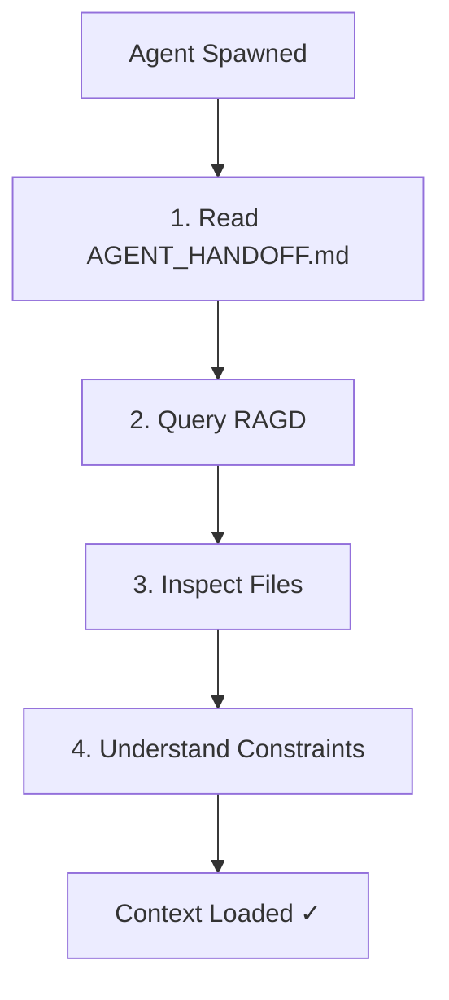

# Agent Context Loading

**Purpose:** How agents load context before code changes.

---

## Why Context Loading Matters

Agents without context:
- Duplicate existing solutions
- Break working systems
- Miss important constraints
- Hallucinate repo behavior

Agents with context:
- Understand current architecture
- Follow established patterns
- Avoid known pitfalls
- Make informed decisions

**Context loading is mandatory before code changes.**

---

## Context Loading Workflow



---

## Step 1: Read Handoff

**Purpose:** Understand current state.

```bash
cat /home/Martin/Dominion/AGENT_HANDOFF.md
```

**Extract:**
- Platform status (LIVE_GREEN, BROKEN, etc.)
- Recent changes
- Known issues
- Validation baseline (test counts, health checks)
- Next recommended task
- Open questions

**Time:** 1-2 minutes

---

## Step 2: Query RAGD

**Purpose:** Load relevant docs/code.

### Basic Query

```bash
python scripts/dominion_cli.py search "<your task>" --top-k 5 --json
```

**Example:**
```bash
python scripts/dominion_cli.py search "implement data pipeline feature" --top-k 5
```

### Python API

```python
from ragd.scripts.ragd_mcp_stdio import ragd_query

result = ragd_query(
    text="implement data pipeline feature",
    top_k=5
)

for chunk in result["chunks"]:
    print(f"{chunk['document_id']}:{chunk['start_line']}")
    print(chunk['content'][:200])
    print()
```

### Direct HTTP

```bash
curl -X POST http://127.0.0.1:7474/query \
  -H 'Content-Type: application/json' \
  -d '{
    "q": "implement data pipeline feature",
    "top_k": 5,
    "filters": {
      "doc_type": {"$in": ["architecture", "feature"]},
      "status": "current"
    }
  }'
```

---

## Query Patterns

### For Feature Implementation

```
"implement <feature name> feature"
"add <feature name> to <subsystem>"
"<feature name> architecture"
```

**Filter:**
```json
{
  "doc_type": {"$in": ["feature", "architecture"]},
  "ragd_priority": {"$gte": 7}
}
```

### For Bug Fix

```
"fix <bug description> bug"
"<subsystem> error handling"
"<error message> debug"
```

**Filter:**
```json
{
  "system": "<affected subsystem>",
  "status": "current"
}
```

### For Refactor

```
"refactor <component> code"
"<component> architecture"
"<component> design patterns"
```

**Filter:**
```json
{
  "doc_type": {"$in": ["architecture", "development"]},
  "audience": {"$in": ["ai_agent"]}
}
```

### For Documentation

```
"documentation standards"
"doc format <doc type>"
"writing guide"
```

**Filter:**
```json
{
  "doc_type": {"$in": ["development", "workflow"]},
  "tags": {"$in": ["documentation", "standards"]}
}
```

---

## Step 3: Inspect Files

**Purpose:** Read actual code, don't hallucinate.

### From RAGD Results

```python
# Extract file paths from RAGD results
files = set(chunk["document_id"] for chunk in result["chunks"])

# Read files
for file_path in files:
    with open(file_path) as f:
        content = f.read()
    # Inspect content
```

### Search for Related Files

```bash
# Find related Python files
find . -name "*pipeline*.py" | head -10

# Grep for patterns
grep -r "class DataPipeline" --include="*.py"

# Find tests
find . -path "*/tests/test_*pipeline*.py"
```

### Check Git History

```bash
# Recent changes
git log --oneline --since="1 week ago" -- data_pipeline/

# Who changed file
git blame data_pipeline/pipeline.py

# File history
git log --follow -p data_pipeline/pipeline.py
```

---

## Step 4: Understand Constraints

**Check for:**

### Safety Constraints

```bash
# Trading rules
cat config/forbidden_tokens.json

# Safety docs
cat docs/09_RISK_AND_SECURITY/AGENT_SAFETY_RULES.md
```

### Architectural Constraints

- Dependency graph (can't introduce cycles)
- Module boundaries (don't bypass abstractions)
- Design patterns (follow existing patterns)

### Performance Constraints

- Native scan: <50ms for 1500 files
- RAGD query: <100ms p95
- Data pipeline: real-time capable

### Testing Constraints

- All tests must pass
- >80% coverage for new code
- No skipped tests

---

## Context Checklist

Before coding:

- [ ] Read AGENT_HANDOFF.md
- [ ] Queried RAGD (top 5 results)
- [ ] Inspected relevant files
- [ ] Checked for similar code
- [ ] Understood safety rules
- [ ] Identified architectural constraints
- [ ] Noted performance requirements
- [ ] Found existing tests
- [ ] Extracted design patterns
- [ ] Listed dependencies

---

## Common Mistakes

### Mistake: Skip RAGD Query

**Problem:** Duplicate existing solution or break working system.

**Fix:** Always query RAGD, even for "simple" tasks.

### Mistake: Vague Query

**Bad:** "code"  
**Good:** "implement Kalman fusion for data pipeline"

**Fix:** Use specific, task-focused queries.

### Mistake: Ignore RAGD Results

**Problem:** Miss important context (e.g., known limitations, required patterns).

**Fix:** Read all top-5 results, not just first one.

### Mistake: Hallucinate Behavior

**Problem:** Assume code works certain way without reading it.

**Fix:** Read actual files, don't guess.

### Mistake: Miss Safety Rules

**Problem:** Add trading code, leak secrets, break platform.

**Fix:** Always read AGENT_SAFETY_RULES.md.

---

## Context Depth by Task Size

### Small Task (<1 hour)

- Read handoff
- Query RAGD (top 3)
- Inspect 1-2 files
- Check safety rules

### Medium Task (1-4 hours)

- Read handoff
- Query RAGD (top 5)
- Inspect 5-10 files
- Check safety rules
- Review related tests
- Check architectural docs

### Large Task (>4 hours)

- Read handoff
- Query RAGD (top 10)
- Inspect 10+ files
- Check safety rules
- Review all related tests
- Read architectural docs
- Review decision logs (ADRs)
- Check roadmap
- Consult backlog

---

## Iterative Context Loading

**Don't load everything upfront.**

1. Load high-level context (handoff + RAGD query)
2. Start work
3. When blocked, load more context (specific files, tests, docs)
4. Repeat

**Efficient:** Load what you need when you need it.

---

## Validation

After context loading:

```python
# Can answer these questions?
assert "What is current platform status?"
assert "What are safety rules?"
assert "Where is relevant code?"
assert "What tests exist?"
assert "What are architectural constraints?"
assert "Are there similar implementations?"
```

If can't answer, load more context.

---

## Context Refresh

**When to refresh:**
- Task takes >2 hours → re-read handoff (may have changed)
- Stuck on problem → query RAGD with refined query
- Hit unexpected error → search for error message in docs/code

---

## Tools

### RAGD Query

```bash
python scripts/dominion_cli.py search "<query>" --top-k 5 --json
```

### File Search

```bash
find . -name "*pattern*.py" -not -path "./.venv/*"
grep -r "pattern" --include="*.py" --exclude-dir=".venv"
```

### Git Search

```bash
git log --all --grep="pattern"
git log --oneline --since="1 month ago" -- path/
```

### Doc Search

```bash
grep -r "pattern" docs/
```

---

## Related Docs

- [AGENT_README.md](../AGENT_README.md)
- [AGENT_OPERATING_SYSTEM.md](AGENT_OPERATING_SYSTEM.md)
- [RAGD_AGENT_USAGE.md](../02_RAGD/RAGD_AGENT_USAGE.md)
- [RAGD_QUERY_PATTERNS.md](../02_RAGD/RAGD_QUERY_PATTERNS.md)

---

## Retrieval Hints

- "context loading"
- "how to load context"
- "agent context"
- "what to read before coding"
- "RAGD query for agents"
