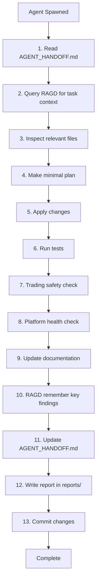

# Agent Operating System

**Version:** 2.0  
**Purpose:** Complete workflow protocol for AI coding agents

---

## Golden Workflow

Every agent follows this workflow:



---

## Step 1: Read Current State

**MANDATORY FIRST STEP**

```bash
cat /home/Martin/Dominion/AGENT_HANDOFF.md
```

This file tells you:
- Current platform status (LIVE_GREEN, BROKEN, etc.)
- Recent changes
- Known issues
- Validation baseline
- Next recommended task
- Open questions

Do NOT proceed without reading this file.

---

## Step 2: Query RAGD

**MANDATORY BEFORE CODE CHANGES**

```bash
# CLI (always available)
python scripts/dominion_cli.py search "<your task>" --top-k 5 --json

# Direct HTTP
curl -X POST http://127.0.0.1:7474/query \
  -H 'Content-Type: application/json' \
  -d '{"q":"<your task>","top_k":5}'
```

**Note:** MCP tool `ragd_query` referenced in some docs but not currently connected. Use CLI/REST API above.

Use task-specific queries:
- ✓ "implement data pipeline feature"
- ✓ "fix LOB reconstruction bug"
- ✓ "add RAGD metadata schema"
- ✗ "code" (too vague)
- ✗ "help" (not specific)

---

## Step 3: Inspect Code

Read actual files. Do NOT hallucinate.

```bash
# Find relevant files
find . -name "*pipeline*.py" | head -10

# Read files
cat data_pipeline/pipeline.py

# Search for patterns
grep -r "Kalman" data_pipeline/
```

---

## Step 4: Make Plan

Write down:
1. Files you'll touch
2. Changes you'll make
3. Tests you'll add/update
4. Docs you'll update
5. Validation steps

If plan is large, create tasks:
```bash
python scripts/dominion_cli.py agent task create \
  --name "Add feature X" \
  --description "..." \
  --priority high
```

---

## Step 5: Apply Changes

**Rules:**
- Minimal diffs only
- One feature at a time
- Don't refactor unrelated code
- Follow existing patterns
- Add tests for new code
- Handle errors gracefully
- No security vulnerabilities

---

## Step 6: Run Tests

**MANDATORY**

```bash
# All Python tests
python -m pytest -q

# Specific subsystem
python -m pytest -q data_pipeline/tests/

# All C++ tests (if C++ changed)
ctest --test-dir ragd/build --output-on-failure
```

All tests MUST pass.

---

## Step 7: Trading Safety Check

**MANDATORY**

```bash
python domdata/check_no_trading.py
```

This MUST output "PASS".

If it fails:
1. STOP immediately
2. Do NOT commit
3. Remove trading-related code
4. Run check again

---

## Step 8: Platform Health Check

**RECOMMENDED**

```bash
# Offline health (no RAGD dependency)
python scripts/dominion_cli.py doctor --offline --json

# Full health (includes RAGD)
python scripts/dominion_cli.py doctor --json

# Vault integrity
python scripts/dominion_cli.py vault doctor --json

# Full validation
bash scripts/verify_live.sh
```

---

## Step 9: Update Documentation

Update as relevant:
1. `/AGENT_HANDOFF.md` — Current state section
2. `docs/01_ARCHITECTURE/` — If architecture changed
3. `docs/05_FEATURES/` — If feature added/changed
4. `docs/09_RISK_AND_SECURITY/RISK_REGISTER.md` — If new risks
5. `docs/10_DECISION_LOGS/` — If architectural decision (ADR)
6. `docs/14_BACKLOG/` — If work discovered
7. `docs/RAGD_INGESTION_MANIFEST.md` — If docs added

---

## Step 10: Remember Key Findings

**RECOMMENDED**

```bash
# Update AGENT_HANDOFF.md or PROGRESS.md directly
# Document decisions in appropriate doc section
```

**Note:** MCP tool `ragd_remember` and CLI command `graph store` referenced in some docs but not available. For now, update handoff/progress docs directly.

Store:
- Important architectural decisions
- Safety-relevant findings
- Non-obvious gotchas
- Performance insights
- Known limitations discovered

---

## Step 11: Update Handoff

**MANDATORY**

Edit `/AGENT_HANDOFF.md`:

1. Update "Current State" date
2. Add your changes to appropriate section
3. Update validation baseline if changed
4. Note any open questions
5. Suggest next recommended task

---

## Step 12: Write Report

**MANDATORY**

Create `reports/<phase-name>-<YYYYMMDD-HHMMSS>.md`:

Must include:
- **What changed** (files, features, tests)
- **Why** (problem statement)
- **How to use** (commands, examples)
- **Validation results** (test output, health checks)
- **Known limitations** (incomplete work)
- **Next steps** (recommended follow-up)

---

## Step 13: Commit

**Use conventional commit format:**

```bash
git add <files>
git commit -m "feat|fix|docs|refactor|test: <description>

<body explaining why>

Co-Authored-By: Claude Sonnet 4.5 <noreply@anthropic.com>"
```

**Do NOT:**
- Commit secrets
- Commit large binaries
- Force push to main
- Skip hooks
- Amend published commits

---

## Validation Checklist

Before claiming completion:

- [ ] Read AGENT_HANDOFF.md
- [ ] Queried RAGD for context
- [ ] Made minimal diffs
- [ ] Added/updated tests
- [ ] `python domdata/check_no_trading.py` → PASS
- [ ] `python -m pytest -q` → PASS
- [ ] C++ tests pass (if relevant)
- [ ] Updated docs
- [ ] Updated AGENT_HANDOFF.md
- [ ] Wrote report
- [ ] Committed properly
- [ ] No secrets leaked
- [ ] Platform still LIVE_GREEN

---

## Common Mistakes

**Mistake:** Skipping RAGD query  
**Fix:** Always query RAGD before code changes

**Mistake:** Making massive rewrites  
**Fix:** Make minimal diffs, one feature at a time

**Mistake:** Not running trading check  
**Fix:** ALWAYS run `python domdata/check_no_trading.py`

**Mistake:** Hallucinating behavior  
**Fix:** Read actual code, don't assume

**Mistake:** Breaking tests  
**Fix:** Run tests frequently, fix immediately

**Mistake:** Not updating docs  
**Fix:** Documentation is a first-class deliverable

**Mistake:** Vague commit messages  
**Fix:** Explain WHY, not just WHAT

---

## Emergency Recovery

**If you break something:**
1. Update AGENT_HANDOFF.md with BROKEN status
2. Document what broke
3. Attempt revert
4. Write incident report
5. Ask human for help

**If tests fail:**
1. Don't skip or disable tests
2. Fix underlying issue
3. Re-run tests

**If trading check fails:**
1. STOP immediately
2. Remove trading code
3. Re-run check

---

## Related Docs

- [AGENT_README.md](../AGENT_README.md) — Agent operating manual
- [AGENT_HANDOFF_PROTOCOL.md](AGENT_HANDOFF_PROTOCOL.md) — Handoff format
- [09_RISK_AND_SECURITY/AGENT_SAFETY_RULES.md](../09_RISK_AND_SECURITY/AGENT_SAFETY_RULES.md) — Safety details

---

## Retrieval Hints

- "agent workflow"
- "how to work as agent"
- "step by step agent process"
- "what agents must do"
