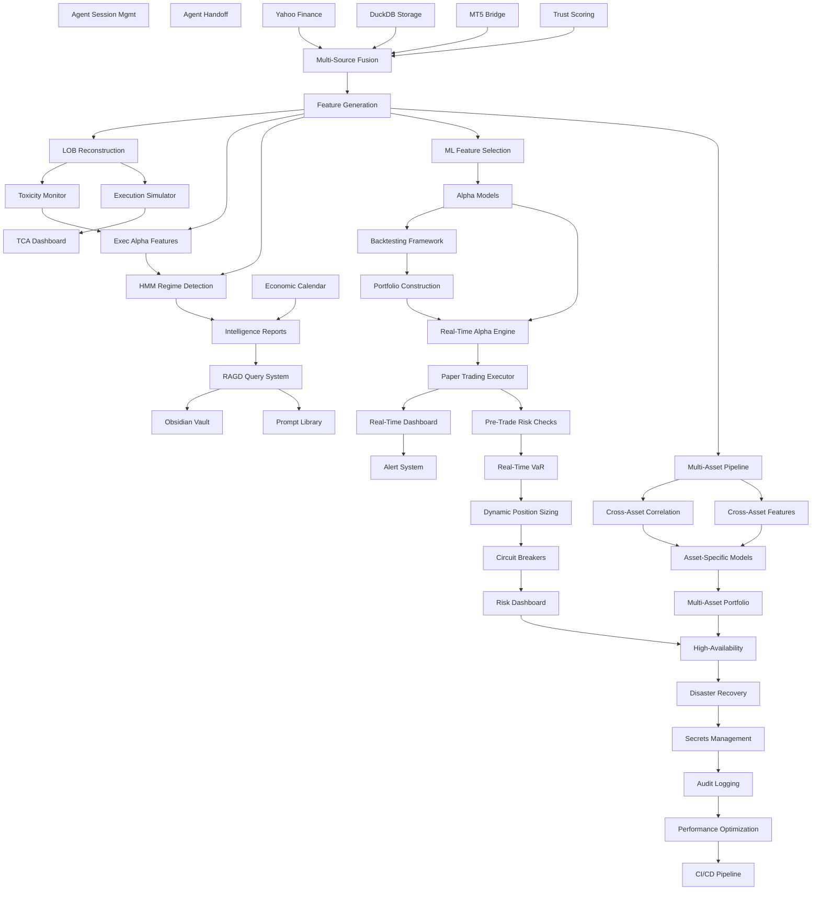

# Feature Dependency Map

**Purpose:** Visualize feature dependencies to guide development sequencing.

**Status:** Current as of Phase 5 (Q2 2026).

---

## Dependency Graph (High-Level)



---

## Critical Path (Blocks Production)

**Sequential dependencies that must be completed for production launch:**

```
Phase 0: Foundation
└─ RAGD + Agent OS (complete)
   │
Phase 1-2: Data Infrastructure
└─ Yahoo → Multi-Source → Feature Generation (complete)
   │
Phase 3: Microstructure
└─ LOB → Exec Sim → TCA (complete)
   │
Phase 6: Alpha Research
└─ Feature Selection → Alpha Models → Backtesting → Portfolio Construction
   │
Phase 7: Paper Trading
└─ Real-Time Alpha Engine → Paper Executor
   │
Phase 8: Risk Management
└─ Pre-Trade Checks → Circuit Breakers
   │
Phase 10: Production
└─ High-Availability → Disaster Recovery → Audit Logging
   │
   PRODUCTION READY ✓
```

**Estimated Timeline:**
- Phase 6: 3 months (Q2-Q3 2026)
- Phase 7: 3 months (Q3-Q4 2026)
- Phase 8: 3 months (Q4 2026 - Q1 2027)
- Phase 10: 3 months (Q4 2027 - Q1 2028)
- **Total: ~18 months from Phase 5 completion**

---

## Parallel Tracks

**These can be developed independently:**

### Track 1: Alpha Research (Phase 6)
```
Feature Selection → Alpha Models (Linear, Tree, Neural) → Ensemble
```
- No dependencies on other tracks
- Can prototype while paper trading runs

### Track 2: Risk Management (Phase 8)
```
VaR → Dynamic Sizing → Risk Dashboard
```
- Depends on Paper Trading for validation
- Independent of Multi-Asset

### Track 3: Multi-Asset (Phase 9)
```
Multi-Asset Pipeline → Correlation → Asset-Specific Models → Portfolio
```
- Depends on Phase 6 (alpha models)
- Independent of Risk Management

### Track 4: Infrastructure (Phase 10)
```
DR → Secrets → Audit Log → Perf Opt → CI/CD
```
- Depends on all prior phases for validation
- Can start HA + DR early (Phase 8)

---

## Dependency Matrix

| Feature | Depends On | Blocks |
|---|---|---|
| **Phase 0** | | |
| RAGD | None | Intelligence Reports, Vault |
| Agent OS | None | Agent Handoff |
| Agent Handoff | Agent OS | None |
| **Phase 1** | | |
| Yahoo Finance | None | Multi-Source Fusion |
| DuckDB Storage | None | Multi-Source Fusion |
| **Phase 2** | | |
| Multi-Source Fusion | Yahoo, DuckDB | Feature Generation |
| MT5 Bridge | None | Multi-Source Fusion |
| Trust Scoring | None | Multi-Source Fusion |
| Feature Generation | Multi-Source | LOB, Exec Features, HMM |
| **Phase 3** | | |
| LOB Reconstruction | Feature Generation | Toxicity, Exec Sim |
| Execution Simulator | LOB | TCA |
| TCA Dashboard | Exec Sim | None |
| Toxicity Monitor | LOB | Exec Features |
| Exec Alpha Features | Feature Generation, Toxicity | HMM |
| **Phase 4** | | |
| HMM Regime Detection | Feature Generation, Exec Features | Intelligence Reports, Dynamic Sizing |
| Economic Calendar | None | Intelligence Reports |
| Intelligence Reports | HMM, Calendar | RAGD (ingestion) |
| **Phase 5** | | |
| Obsidian Vault | RAGD | None |
| Prompt Library | RAGD | None |
| **Phase 6** | | |
| Feature Selection | Feature Generation | Alpha Models |
| Alpha Models | Feature Selection | Real-Time Alpha |
| Backtesting | Alpha Models | Portfolio Construction |
| Portfolio Construction | Backtesting | Real-Time Alpha |
| **Phase 7** | | |
| Real-Time Alpha | Alpha Models, Portfolio | Paper Executor |
| Paper Executor | Real-Time Alpha | Pre-Trade Checks, Dashboard |
| Dashboard | Paper Executor | Alerts |
| Alerts | Dashboard | None |
| **Phase 8** | | |
| Pre-Trade Checks | Paper Executor | VaR |
| VaR | Pre-Trade Checks | Dynamic Sizing |
| Dynamic Sizing | VaR, HMM | Circuit Breakers |
| Circuit Breakers | Dynamic Sizing | Risk Dashboard |
| Risk Dashboard | Circuit Breakers | HA Deployment |
| **Phase 9** | | |
| Multi-Asset Pipeline | Feature Generation | Cross-Asset Correlation |
| Cross-Asset Correlation | Multi-Asset Pipeline | Asset-Specific Models |
| Cross-Asset Features | Multi-Asset Pipeline | Asset-Specific Models |
| Asset-Specific Models | Cross-Asset Corr, Cross-Asset Features | Multi-Asset Portfolio |
| Multi-Asset Portfolio | Asset-Specific Models | HA Deployment |
| **Phase 10** | | |
| HA Deployment | Risk Dashboard, Multi-Asset Portfolio | DR |
| Disaster Recovery | HA | Secrets Management |
| Secrets Management | DR | Audit Logging |
| Audit Logging | Secrets | Performance Opt |
| Performance Opt | Audit Logging | CI/CD |
| CI/CD | Performance Opt | Production Launch |

---

## External Dependencies

**Required for Development:**

| Feature | External Dependency | Fallback |
|---|---|---|
| Yahoo Finance | yfinance library | None (critical) |
| MT5 Bridge | domdata CLI, MT5 account | Yahoo Finance (delayed) |
| Economic Calendar | FRED API, NewsAPI | Manual calendar |
| RAGD | sqlite-vss, HNSW | Fallback to FTS5 only |
| Alpha Models (Neural) | pytorch/tensorflow, GPU | Tree models only |
| Sentiment Analysis | Twitter API, FinBERT | Deprecated |
| Options Data | CBOE, TDAmeritrade | Experimental only |
| Cloud Deployment | AWS/GCP/Azure | Local deployment |
| Secrets Management | HashiCorp Vault / AWS Secrets | File-based (dev) |
| CI/CD | GitHub Actions | Manual deployment |

**Risk Mitigation:**
- Yahoo Finance: Critical, no fallback → monitor API stability
- MT5: Important, fallback to Yahoo (delayed data acceptable)
- FRED: Nice-to-have, manual calendar fallback
- Cloud: Optional, local deployment for solo researcher

---

## Circular Dependencies (Avoided)

**Potential circular dependencies identified + resolved:**

### 1. Feature Generation ↔ Alpha Models
- **Problem:** Alpha models select features, features trained on alpha labels
- **Resolution:** Two-stage process (generate all → select subset)

### 2. Regime Detection ↔ Features
- **Problem:** Regime features depend on regime labels, regime labels depend on features
- **Resolution:** Regime uses base features (returns, vol), not regime-conditional features

### 3. VaR ↔ Position Sizing
- **Problem:** VaR depends on positions, position sizing depends on VaR
- **Resolution:** VaR uses current positions, sizing uses forecasted VaR

### 4. RAGD ↔ Documentation
- **Problem:** RAGD ingests docs, docs describe RAGD
- **Resolution:** Bootstrap problem (manual RAGD docs first, then auto-ingest)

---

## Bottleneck Analysis

**Features that block many others (high fan-out):**

1. **Feature Generation** (blocks 8 features)
   - LOB, Exec Features, HMM, Feature Selection, Multi-Asset
   - **Critical:** Optimize performance early

2. **Alpha Models** (blocks 6 features)
   - Real-Time Alpha, Backtesting, Portfolio, Paper Trading
   - **Critical:** Validate early (Phase 6)

3. **Multi-Source Fusion** (blocks 5 features)
   - Feature Generation, LOB, Exec Features, HMM
   - **Status:** Complete (Phase 2) ✓

4. **Paper Executor** (blocks 5 features)
   - Pre-Trade Checks, Dashboard, Alerts, VaR, Circuit Breakers
   - **Critical:** High-quality implementation (Phase 7)

**Optimization Strategy:**
- Prioritize bottleneck features (parallelization, caching)
- Fail-fast validation (test Phase 6 alphas early)
- Decouple where possible (avoid adding dependencies)

---

## Development Sequencing

**Recommended order for maximum parallelism:**

### Wave 1 (Phase 6, 3 months)
- Feature Selection (Week 1-4)
- Alpha Models (Week 5-12) — parallel: Linear, Tree, Neural
- Backtesting (Week 9-12, overlaps with models)

### Wave 2 (Phase 7, 3 months)
- Real-Time Alpha Engine (Week 1-4)
- Paper Executor (Week 5-8)
- Dashboard + Alerts (Week 9-12, parallel)

### Wave 3 (Phase 8, 3 months)
- Pre-Trade Checks (Week 1-4)
- VaR + Dynamic Sizing (Week 5-8, parallel)
- Circuit Breakers + Risk Dashboard (Week 9-12)

### Wave 4 (Phase 9, 6 months)
- Multi-Asset Pipeline (Month 1-2)
- Cross-Asset Correlation + Features (Month 3-4, parallel)
- Asset-Specific Models (Month 5-6)

### Wave 5 (Phase 10, 3 months)
- HA + DR (Month 1, parallel)
- Secrets + Audit Log (Month 2, parallel)
- Performance Opt + CI/CD (Month 3, parallel)

**Total: 18 months (Phase 6 → Production)**

---

## Related Documentation

- [[CURRENT_FEATURES]] — Operational features
- [[PLANNED_FEATURES]] — Roadmap (Phase 6-10)
- [[FEATURE_PRIORITY_MATRIX]] — Prioritization framework
- [[ARCHITECTURE_OVERVIEW]] — System architecture
- [[DATA_FLOW]] — Data pipeline architecture
- [[CONTROL_FLOW]] — Control flow diagrams

---

## Maintenance Notes

**Last Updated:** 2026-05-19 (Phase 5)

**Update Frequency:** After each phase completion

**How to Update:**
1. Add new features to dependency matrix
2. Update Mermaid graph (add nodes + edges)
3. Recalculate critical path
4. Identify new bottlenecks
5. Update development sequencing
