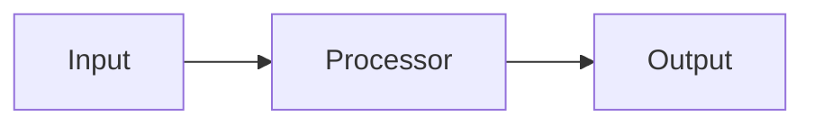

# Feature Template

**Purpose:** Template for documenting new features in Dominion V2.

---

## Metadata

Copy this frontmatter to all new feature docs:

```yaml
---
doc_type: feature
system: Dominion
ragd_priority: [6-8, depending on importance]
audience:
  - [developer/maintainer/researcher]
status: [planned/in_development/operational/deprecated]
last_reviewed: YYYY-MM-DD
tags:
  - feature
  - [domain-specific tags]
---
```

---

## Feature Name

**One-line summary** — What this feature does in 10 words or less.

---

## Overview

**Purpose:**
What problem does this feature solve?

**Status:**
- Planned / In Development / Operational / Deprecated
- If operational: X/Y tests passing

**Related Features:**
- [[OTHER_FEATURE_1]]
- [[OTHER_FEATURE_2]]

---

## Architecture

**Components:**
1. Component 1 — Description
2. Component 2 — Description
3. Component 3 — Description

**Data Flow:**
```
Input → Processing → Output
```

Optionally include Mermaid diagram:


---

## API / CLI

**Python API:**
```python
from module import FeatureClass

# Usage example
feature = FeatureClass(param1, param2)
result = feature.compute(data)
```

**CLI:**
```bash
python -m module.cli command --option value
```

**Key Methods:**
- `method1(arg1, arg2)` — Description
- `method2(arg1)` — Description

---

## Algorithms

**Algorithm 1: Name**
- Description
- Formula (if applicable):
  ```
  y = f(x)
  ```
- Complexity: O(n)

**Algorithm 2: Name**
- Description
- Parameters: `param1`, `param2`

---

## Configuration

**Parameters:**
```python
PARAM_1 = value  # Description
PARAM_2 = value  # Description
```

**Tuning:**
- Parameter X affects Y
- Recommended range: [min, max]

---

## Testing

**Test Coverage:**
- X/Y tests passing
- Coverage: Z%

**Test Files:**
- `tests/test_feature.py`

**Key Tests:**
1. Test 1: Description
2. Test 2: Description
3. Integration test: Description

---

## Performance

**Metrics:**
- Throughput: X items/second
- Latency: Y ms
- Memory: Z MB

**Benchmarks:**
- Baseline: [description]
- Optimized: [description]

---

## Dependencies

**Internal:**
- [[FEATURE_1]] — Why
- [[FEATURE_2]] — Why

**External:**
- library1 — Why
- library2 — Why

---

## Known Limitations

1. **Limitation 1**
   - Description
   - Workaround: [if any]

2. **Limitation 2**
   - Description
   - Future work: [if planned]

---

## Metrics and Validation

**Key Metrics:**
- Metric 1: Target value
- Metric 2: Target value

**Validation:**
- How to verify this feature works correctly
- Expected results

---

## Future Work

**Planned Enhancements:**
- Enhancement 1 — Expected Phase X
- Enhancement 2 — Expected Phase Y

**Research Questions:**
- Question 1
- Question 2

---

## Related Documentation

- [[ARCHITECTURE_DOC]] — System context
- [[ADR_XXXX]] — Decision rationale
- [[FEATURE_SPEC]] — Related feature
- [[TESTING_DOC]] — Testing strategy

---

## Changelog

| Date | Change | Author |
|---|---|---|
| YYYY-MM-DD | Initial implementation | Name |
| YYYY-MM-DD | Enhancement X | Name |

---

## Notes

Additional context, gotchas, debugging tips, etc.
