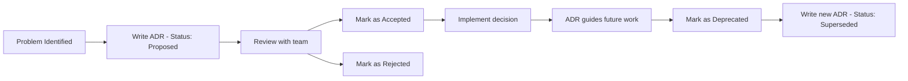

# Architecture Decision Records (ADR) Index

**Purpose:** Catalog of all architectural decisions.

---

## Active ADRs

| ADR | Title | Date | Status | Impact |
|---|---|---|---|---|
| [[ADR_0001_sqlite_over_postgres]] | SQLite Over PostgreSQL for RAGD | 2024-12-16 | Accepted | High |
| [[ADR_0002_native_cpp_scan_over_python]] | Native C++ File Scan Over Pure Python | 2025-03-11 | Accepted | Medium |
| [[ADR_0003_kalman_fusion_over_simple_average]] | Kalman Fusion Over Simple Average | 2025-09-22 | Accepted | High |

---

## ADR Status

| Status | Meaning | Next Action |
|---|---|---|
| **Proposed** | Under consideration | Review and decide |
| **Accepted** | Approved and active | Implement |
| **Deprecated** | No longer recommended | Migrate away |
| **Superseded** | Replaced by newer ADR | Use replacement |

---

## How to Write an ADR

See [ADR_TEMPLATE.md](ADR_TEMPLATE.md).

**Quick process:**
1. Copy template
2. Assign next ADR number
3. Fill sections (context, decision, consequences, alternatives)
4. Get review (human or senior agent)
5. Mark as Accepted
6. Add to this index
7. Commit

---

## When to Write an ADR

**Write ADR for:**
- Architecture changes (module structure, dependencies)
- Technology choices (frameworks, libraries)
- Data models (schema changes)
- APIs (endpoint design)
- Security decisions (authentication, authorization)
- Performance tradeoffs (caching, optimization)
- Process changes (workflow, testing strategy)

**Don't write ADR for:**
- Bug fixes (unless they reveal design flaw)
- Minor refactors (unless they change patterns)
- Docs updates (unless they change philosophy)
- Code style (covered by CODING_STANDARDS.md)

---

## ADR Lifecycle



---

## Finding Relevant ADRs

**By topic:**
```bash
grep -r "data pipeline" docs/10_DECISION_LOGS/
grep -r "RAGD" docs/10_DECISION_LOGS/
```

**By date:**
```bash
ls -lt docs/10_DECISION_LOGS/ADR_*.md
```

**By impact:**
- High impact: Affects multiple subsystems
- Medium impact: Affects single subsystem
- Low impact: Localized change

---

## ADR Numbering

**Format:** `ADR_<NNNN>_<slug>.md`

**Examples:**
- `ADR_0001_DOCUMENTATION_SYSTEM.md`
- `ADR_0042_KALMAN_FUSION_ALGORITHM.md`
- `ADR_0123_API_VERSIONING_STRATEGY.md`

**Numbering:**
- 4 digits, zero-padded
- Sequential (no gaps OK)
- Never reuse numbers

---

## Related Docs

- [ADR_TEMPLATE.md](ADR_TEMPLATE.md)
- [06_ROADMAP/MASTER_ROADMAP.md](../06_ROADMAP/MASTER_ROADMAP.md)
- [01_ARCHITECTURE/](../01_ARCHITECTURE/)

---

## Retrieval Hints

- "ADR"
- "architecture decision"
- "decision log"
- "why did we choose"
- "design decision"
