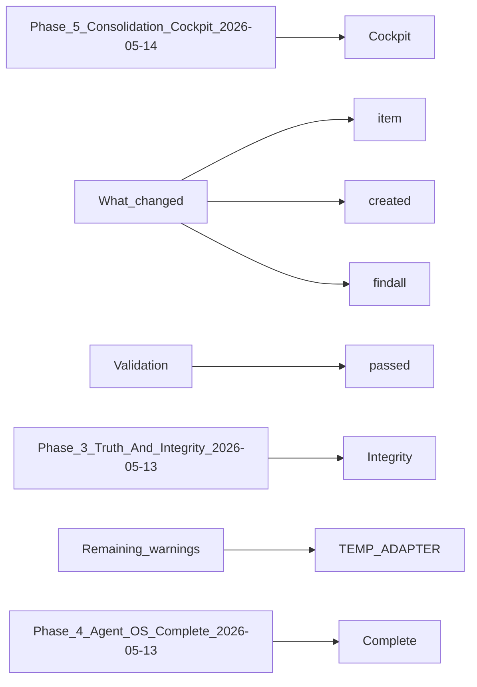

# AGENT_HANDOFF.md

> **Language**: `markdown` | **Symbols**: 24

## Purpose

Defines 24 indexed symbol(s): # Dominion Agent Handoff, ## Phase 5 — Consolidation + Cockpit (2026-05-14), ### What changed, ### Validation, ### Open items.

## Public Symbols

| Symbol | Type | Lines | Description |
|---|---|---:|---|
| [[symbols/Dominion_Agent_Handoff-L1-db9bdd07|# Dominion Agent Handoff]] | section | 1-2 | # Dominion Agent Handoff |
| [[symbols/Phase_5_Consolidation_Cockpit_2026-05-14-L3-46e8a6d0|## Phase 5 — Consolidation + Cockpit (2026-05-14)]] | section | 3-6 | ## Phase 5 — Consolidation + Cockpit (2026-05-14) |
| [[symbols/What_changed-L7-eac837d5|### What changed]] | section | 7-17 | ### What changed |
| [[symbols/Validation-L18-46301edd|### Validation]] | section | 18-27 | ### Validation |
| [[symbols/Open_items-L28-223677c9|### Open items]] | section | 28-37 | ### Open items |
| [[symbols/Phase_3_Truth_And_Integrity_2026-05-13-L38-292b236a|## Phase 3 — Truth And Integrity (2026-05-13)]] | section | 38-41 | ## Phase 3 — Truth And Integrity (2026-05-13) |
| [[symbols/What_changed-L42-9d83a256|### What changed]] | section | 42-49 | ### What changed |
| [[symbols/Evidence-L50-447799eb|### Evidence]] | section | 50-59 | ### Evidence |
| [[symbols/Remaining_warnings-L60-304e8587|### Remaining warnings]] | section | 60-70 | ### Remaining warnings |
| [[symbols/Phase_4_Agent_OS_Complete_2026-05-13-L71-b70733f6|## Phase 4 — Agent OS Complete (2026-05-13)]] | section | 71-74 | ## Phase 4 — Agent OS Complete (2026-05-13) |
| [[symbols/What_is_dominion_agent-L75-9e3e6e51|### What is dominion_agent?]] | section | 75-78 | ### What is dominion_agent? |
| [[symbols/Validation-L79-959fea2d|### Validation]] | section | 79-89 | ### Validation |
| [[symbols/Key_Docs-L90-2d20ae53|### Key Docs]] | section | 90-97 | ### Key Docs |
| [[symbols/Open_Items-L98-627e1bba|### Open Items]] | section | 98-104 | ### Open Items |
| [[symbols/Dominion_V2.5_Phase_-_2026-05-12-L105-63ba2362|## Dominion V2.5 Phase - 2026-05-12]] | section | 105-147 | ## Dominion V2.5 Phase - 2026-05-12 |
| [[symbols/Dominion_V2_Superbuild_Handoff_-_2026-05-12-L148-d72e8951|## Dominion V2 Superbuild Handoff - 2026-05-12]] | section | 148-186 | ## Dominion V2 Superbuild Handoff - 2026-05-12 |
| [[symbols/Dominion_V2_Cleanup_-_2026-05-12-L187-7b3d6b2c|## Dominion V2 Cleanup - 2026-05-12]] | section | 187-213 | ## Dominion V2 Cleanup - 2026-05-12 |
| [[symbols/Dominion_V2_Final_Polish_-_2026-05-12-L214-f568f420|## Dominion V2 Final Polish - 2026-05-12]] | section | 214-244 | ## Dominion V2 Final Polish - 2026-05-12 |
| [[symbols/Current_State-L245-262497b8|## Current State]] | section | 245-251 | ## Current State |
| [[symbols/Most_Important_RAGD_Notes-L252-fa803cf1|## Most Important RAGD Notes]] | section | 252-258 | ## Most Important RAGD Notes |
| [[symbols/Next_Agent_Should_Do_First-L259-b0f7fb40|## Next Agent Should Do First]] | section | 259-262 | ## Next Agent Should Do First |
| [[symbols/Useful_Commands-L263-72412efc|## Useful Commands]] | section | 263-272 | ## Useful Commands |
| [[symbols/Agent_2_Phase_2_Handoff_-_2026-05-13-L273-f430ef94|## Agent 2 Phase 2 Handoff - 2026-05-13]] | section | 273-308 | ## Agent 2 Phase 2 Handoff - 2026-05-13 |
| [[symbols/Agent_6_Phase_6_Handoff_-_2026-05-14-L309-d173962e|## Agent 6 Phase 6 Handoff - 2026-05-14]] | section | 309-340 | ## Agent 6 Phase 6 Handoff - 2026-05-14 |

## Imports

- `1003`
- `Windows`
- `aspirational`
- `historical`
- `ragd.scripts.ragd_mcp_stdio`
- `ragd_handoff_read`
- `the`

## Call Graph

## Recent Changes

> Content hash: `d173962ec827cea1`. Last modified epoch: `1778728694`.
