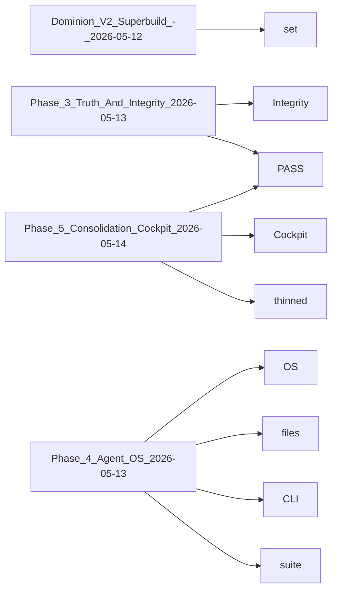

# PROGRESS.md

> **Language**: `markdown` | **Symbols**: 26

## Purpose

Defines 26 indexed symbol(s): # Dominion Overnight Summary, ## Dominion V2 Superbuild - 2026-05-12, ## Phase 3 — Truth And Integrity (2026-05-13), ## Phase 5 — Consolidation + Cockpit (2026-05-14), ## Phase 4 — Agent OS (2026-05-13).

## Public Symbols

| Symbol | Type | Lines | Description |
|---|---|---:|---|
| [[symbols/Dominion_Overnight_Summary-L1-2a8b04b5|# Dominion Overnight Summary]] | section | 1-4 | # Dominion Overnight Summary |
| [[symbols/Dominion_V2_Superbuild_-_2026-05-12-L5-93c66c3e|## Dominion V2 Superbuild - 2026-05-12]] | section | 5-30 | ## Dominion V2 Superbuild - 2026-05-12 |
| [[symbols/Phase_3_Truth_And_Integrity_2026-05-13-L31-85f847c2|## Phase 3 — Truth And Integrity (2026-05-13)]] | section | 31-48 | ## Phase 3 — Truth And Integrity (2026-05-13) |
| [[symbols/Phase_5_Consolidation_Cockpit_2026-05-14-L49-ab994a74|## Phase 5 — Consolidation + Cockpit (2026-05-14)]] | section | 49-68 | ## Phase 5 — Consolidation + Cockpit (2026-05-14) |
| [[symbols/Phase_4_Agent_OS_2026-05-13-L69-b37eb1fc|## Phase 4 — Agent OS (2026-05-13)]] | section | 69-85 | ## Phase 4 — Agent OS (2026-05-13) |
| [[symbols/Executive_Summary-L86-f44137d1|## Executive Summary]] | section | 86-89 | ## Executive Summary |
| [[symbols/PASS_FAIL_Table-L90-bf303a8b|## PASS/FAIL Table]] | section | 90-105 | ## PASS/FAIL Table |
| [[symbols/Files_Changed-L106-9187e883|## Files Changed]] | section | 106-126 | ## Files Changed |
| [[symbols/Backups_Created-L127-44e38b89|## Backups Created]] | section | 127-130 | ## Backups Created |
| [[symbols/Commands_Run-L131-31477ec1|## Commands Run]] | section | 131-134 | ## Commands Run |
| [[symbols/Tests_Passed-L135-38118b1b|## Tests Passed]] | section | 135-145 | ## Tests Passed |
| [[symbols/Tests_Failed_And_Why-L146-3f2539ff|## Tests Failed And Why]] | section | 146-152 | ## Tests Failed And Why |
| [[symbols/Security_Status-L153-db0dda86|## Security Status]] | section | 153-159 | ## Security Status |
| [[symbols/Data_Status-L160-c8bb871f|## Data Status]] | section | 160-168 | ## Data Status |
| [[symbols/Collaboration_Status-L169-537ac4e5|## Collaboration Status]] | section | 169-175 | ## Collaboration Status |
| [[symbols/Codex_Workflow_Status-L176-6176ae85|## Codex Workflow Status]] | section | 176-179 | ## Codex Workflow Status |
| [[symbols/RAGD_Status-L180-b2712af2|## RAGD Status]] | section | 180-197 | ## RAGD Status |
| [[symbols/Remaining_Risks-L198-41dbaef4|## Remaining Risks]] | section | 198-206 | ## Remaining Risks |
| [[symbols/Dominion_V2.5_Phase_Start_-_2026-05-12-L207-3e54a642|## Dominion V2.5 Phase Start - 2026-05-12]] | section | 207-235 | ## Dominion V2.5 Phase Start - 2026-05-12 |
| [[symbols/Exact_Next_Commands_For_Matin-L236-58bac799|## Exact Next Commands For Matin]] | section | 236-246 | ## Exact Next Commands For Matin |
| [[symbols/Exact_Next_Commands_For_Dan-L247-a05d2123|## Exact Next Commands For Dan]] | section | 247-267 | ## Exact Next Commands For Dan |
| [[symbols/Next_Codex_Session-L268-df7ecfb2|## Next Codex Session]] | section | 268-276 | ## Next Codex Session |
| [[symbols/Dominion_V2_Cleanup_-_2026-05-12-L277-8bd5b22b|## Dominion V2 Cleanup - 2026-05-12]] | section | 277-306 | ## Dominion V2 Cleanup - 2026-05-12 |
| [[symbols/Dominion_V2_Final_Polish_-_2026-05-12-L307-dc4de47c|## Dominion V2 Final Polish - 2026-05-12]] | section | 307-332 | ## Dominion V2 Final Polish - 2026-05-12 |
| [[symbols/Agent_2_Phase_2_RAGD_Intelligence_-_2026-05-13-L333-97b8eed3|## Agent 2 Phase 2 RAGD Intelligence - 2026-05-13]] | section | 333-375 | ## Agent 2 Phase 2 RAGD Intelligence - 2026-05-13 |
| [[symbols/Agent_6_Phase_6_RAG_Intelligence_Overhaul_-_2026-05-14-L376-a33dbbe9|## Agent 6 Phase 6 RAG Intelligence Overhaul - 2026-05-14]] | section | 376-411 | ## Agent 6 Phase 6 RAG Intelligence Overhaul - 2026-05-14 |

## Imports

- `Dominion`
- `the`

## Call Graph

## Recent Changes

> Content hash: `a33dbbe9a46b27e5`. Last modified epoch: `1778728705`.
