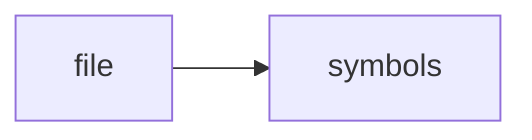

# README.md

> **Language**: `markdown` | **Symbols**: 1

## Purpose

Defines 1 indexed symbol(s): # Dominion.

## Public Symbols

| Symbol | Type | Lines | Description |
|---|---|---:|---|
| [[symbols/Dominion-L1-ada306b1|# Dominion]] | section | 1-26 | # Dominion |

## Imports

- *(none indexed)*

## Call Graph

## Recent Changes

> Content hash: `ada306b165c17621`. Last modified epoch: `-4659044264203807620`.
