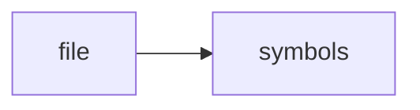

# CODEX_WORKFLOW.md

> **Language**: `markdown` | **Symbols**: 1

## Purpose

Defines 1 indexed symbol(s): # Codex Workflow.

## Public Symbols

| Symbol | Type | Lines | Description |
|---|---|---:|---|
| [[symbols/docs/Codex_Workflow-L1-cab6bbfb|# Codex Workflow]] | section | 1-43 | # Codex Workflow |

## Imports

- *(none indexed)*

## Call Graph

## Recent Changes

> Content hash: `cab6bbfbc5be5f55`. Last modified epoch: `-4659044264199807619`.
