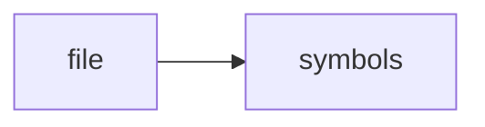

# RAGD_CODEX_WORKFLOW.md

> **Language**: `markdown` | **Symbols**: 1

## Purpose

Defines 1 indexed symbol(s): # RAGD And Codex Workflow.

## Public Symbols

| Symbol | Type | Lines | Description |
|---|---|---:|---|
| [[symbols/docs/RAGD_And_Codex_Workflow-L1-69a65cfd|# RAGD And Codex Workflow]] | section | 1-24 | # RAGD And Codex Workflow |

## Imports

- *(none indexed)*

## Call Graph

## Recent Changes

> Content hash: `69a65cfdfa4fe0a4`. Last modified epoch: `-4659044369519801552`.
