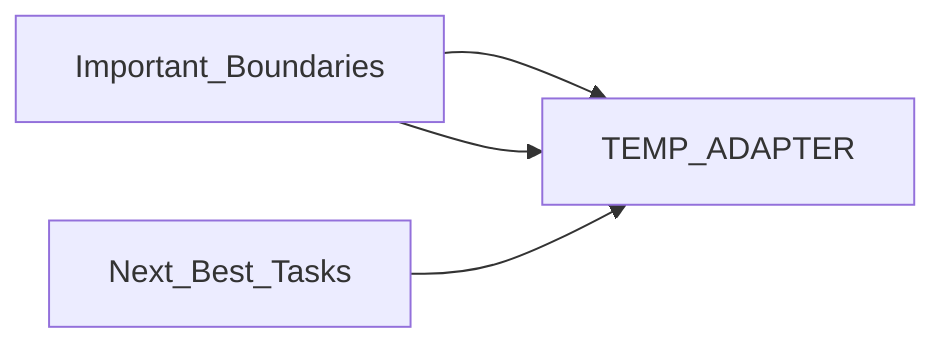

# AGENT_2_HANDOFF.md

> **Language**: `markdown` | **Symbols**: 5

## Purpose

Defines 5 indexed symbol(s): # Agent 2 Handoff, ## What Landed, ## Important Boundaries, ## Evidence, ## Next Best Tasks.

## Public Symbols

| Symbol | Type | Lines | Description |
|---|---|---:|---|
| [[symbols/docs/agents/Agent_2_Handoff-L1-9d67e547|# Agent 2 Handoff]] | section | 1-4 | # Agent 2 Handoff |
| [[symbols/docs/agents/What_Landed-L5-2354af05|## What Landed]] | section | 5-13 | ## What Landed |
| [[symbols/docs/agents/Important_Boundaries-L14-7baff794|## Important Boundaries]] | section | 14-20 | ## Important Boundaries |
| [[symbols/docs/agents/Evidence-L21-ea8e3ac0|## Evidence]] | section | 21-35 | ## Evidence |
| [[symbols/docs/agents/Next_Best_Tasks-L36-a9669b6f|## Next Best Tasks]] | section | 36-41 | ## Next Best Tasks |

## Imports

- *(none indexed)*

## Call Graph

## Recent Changes

> Content hash: `a9669b6f81a1114f`. Last modified epoch: `1778728388`.
