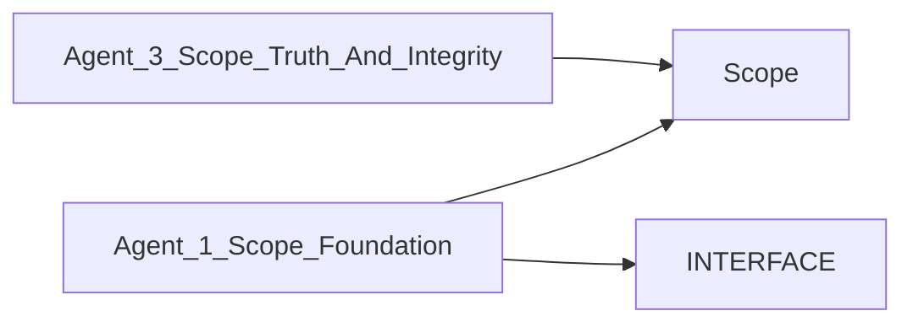

# FEATURE_COMPLETION_MATRIX.md

> **Language**: `markdown` | **Symbols**: 4

## Purpose

Defines 4 indexed symbol(s): # Feature Completion Matrix, ## Agent 1 Scope (Foundation), ## Agent 2 Scope, ## Agent 3 Scope (Truth And Integrity).

## Public Symbols

| Symbol | Type | Lines | Description |
|---|---|---:|---|
| [[symbols/docs/agents/Feature_Completion_Matrix-L1-e75b2042|# Feature Completion Matrix]] | section | 1-2 | # Feature Completion Matrix |
| [[symbols/docs/agents/Agent_1_Scope_Foundation-L3-a1c6e70d|## Agent 1 Scope (Foundation)]] | section | 3-26 | ## Agent 1 Scope (Foundation) |
| [[symbols/docs/agents/Agent_2_Scope-L27-d3e8aa17|## Agent 2 Scope]] | section | 27-42 | ## Agent 2 Scope |
| [[symbols/docs/agents/Agent_3_Scope_Truth_And_Integrity-L43-a80c29c4|## Agent 3 Scope (Truth And Integrity)]] | section | 43-56 | ## Agent 3 Scope (Truth And Integrity) |

## Imports

- *(none indexed)*

## Call Graph

## Recent Changes

> Content hash: `a80c29c414971e7`. Last modified epoch: `1778728375`.
