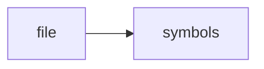

# check_no_trading.py

> **Language**: `python` | **Symbols**: 3

## Purpose

Defines 3 indexed symbol(s): top_level, should_scan, main.

## Public Symbols

| Symbol | Type | Lines | Description |
|---|---|---:|---|
| [[symbols/domdata/top_level-L1-48d4b58a|top_level]] | block | 1-23 | top_level |
| [[symbols/domdata/should_scan-L24-304ff178|should_scan]] | function | 24-31 | should_scan |
| [[symbols/domdata/main-L32-4a8ee736|main]] | function | 32-53 | main |

## Imports

- *(none indexed)*

## Call Graph

## Recent Changes

> Content hash: `4a8ee7364e77673`. Last modified epoch: `-4659114039364910762`.
