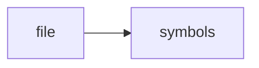

# safety.py

> **Language**: `python` | **Symbols**: 5

## Purpose

Defines 5 indexed symbol(s): top_level, _blocked_trade, apply_read_only_guard, blocked_command, notice.

## Public Symbols

| Symbol | Type | Lines | Description |
|---|---|---:|---|
| [[symbols/domdata/domdata_pkg/top_level-L1-e2d31f6a|top_level]] | block | 1-16 | top_level |
| [[symbols/domdata/domdata_pkg/blocked_trade-L17-b5cc6e44|_blocked_trade]] | function | 17-20 | _blocked_trade |
| [[symbols/domdata/domdata_pkg/apply_read_only_guard-L21-78485401|apply_read_only_guard]] | function | 21-27 | apply_read_only_guard |
| [[symbols/domdata/domdata_pkg/blocked_command-L28-cba3f6ae|blocked_command]] | function | 28-32 | blocked_command |
| [[symbols/domdata/domdata_pkg/notice-L33-9cc65c61|notice]] | function | 33-35 | notice |

## Imports

- *(none indexed)*

## Call Graph

## Recent Changes

> Content hash: `9cc65c616e2e3659`. Last modified epoch: `-4659114046684910036`.
