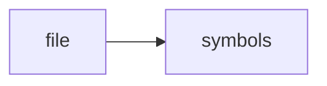

# test_config.py

> **Language**: `python` | **Symbols**: 3

## Purpose

Defines 3 indexed symbol(s): top_level, test_password_masked, test_missing_mask.

## Public Symbols

| Symbol | Type | Lines | Description |
|---|---|---:|---|
| [[symbols/domdata/tests/top_level-L1-7c96cd8a|top_level]] | block | 1-3 | top_level |
| [[symbols/domdata/tests/test_password_masked-L4-bbc9705c|test_password_masked]] | function | 4-7 | test_password_masked |
| [[symbols/domdata/tests/test_missing_mask-L8-2eb46a3b|test_missing_mask]] | function | 8-9 | test_missing_mask |

## Imports

- *(none indexed)*

## Call Graph

## Recent Changes

> Content hash: `2eb46a3bf9708ce`. Last modified epoch: `-4659114036956910931`.
