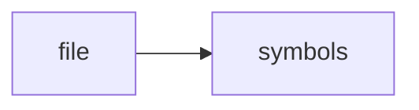

# test_safety.py

> **Language**: `python` | **Symbols**: 3

## Purpose

Defines 3 indexed symbol(s): top_level, test_blocked_commands_include_trading_words, test_blocked_command_exits_nonzero.

## Public Symbols

| Symbol | Type | Lines | Description |
|---|---|---:|---|
| [[symbols/domdata/tests/top_level-L1-423c69ca|top_level]] | block | 1-5 | top_level |
| [[symbols/domdata/tests/test_blocked_commands_include_trading_words-L6-11a7cf39|test_blocked_commands_include_trading_words]] | function | 6-9 | test_blocked_commands_include_trading_words |
| [[symbols/domdata/tests/test_blocked_command_exits_nonzero-L10-76463358|test_blocked_command_exits_nonzero]] | function | 10-13 | test_blocked_command_exits_nonzero |

## Imports

- *(none indexed)*

## Call Graph

## Recent Changes

> Content hash: `7646335825f17067`. Last modified epoch: `-4659114037864910868`.
