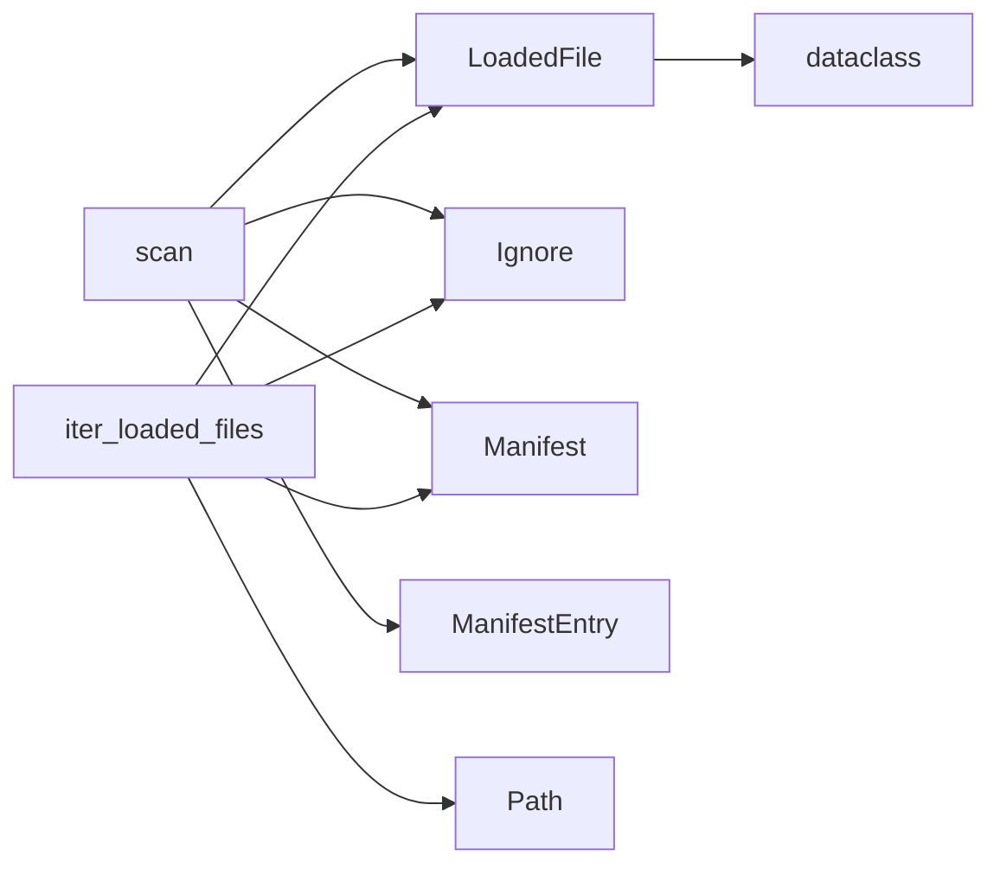

# scan.py

> **Language**: `python` | **Symbols**: 4

## Purpose

A file that has been discovered, classified, and hashed.

## Public Symbols

| Symbol | Type | Lines | Description |
|---|---|---:|---|
| [[symbols/dominion_loader/dominion_loader.scan.LoadedFile-L31-5de41f6d|LoadedFile]] | class | 31-49 | A file that has been discovered, classified, and hashed. |
| [[symbols/dominion_loader/dominion_loader.scan.ScanStats-L52-796d1f4c|ScanStats]] | class | 52-67 | dominion_loader.scan.ScanStats |
| [[symbols/dominion_loader/dominion_loader.scan.scan-L70-0ef1f80d|scan]] | function | 70-312 | Run a full scan of repo_root. |
| [[symbols/dominion_loader/dominion_loader.scan.iter_loaded_files-L315-8f946da1|iter_loaded_files]] | function | 315-369 | Yield LoadedFile for every indexable file under repo_root. |

## Imports

- `__future__`
- `dataclasses`
- `dominion_loader.classify`
- `dominion_loader.discover`
- `dominion_loader.hashing`
- `dominion_loader.ignore`
- `dominion_loader.manifest`
- `dominion_loader.obs`
- `dominion_loader.ragd_bridge`
- `os`
- `pathlib`
- `time`
- `typing`

## Call Graph

## Recent Changes

> Content hash: `8f946da10459d0f3a5f22b9abdb00e901056c1ad032293ec617322148ccf0df1`. Last modified epoch: `1778713713`.
