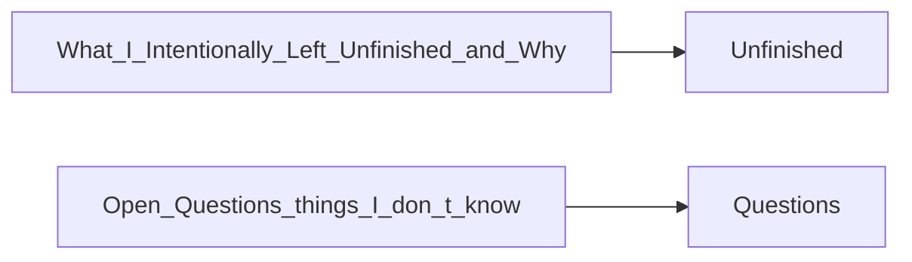

# AGENT_HANDOFF.md

> **Language**: `markdown` | **Symbols**: 10

## Purpose

Defines 10 indexed symbol(s): # HANDOFF NOTE, ## What I Did, ## What I Intentionally Left Unfinished (and Why), ## The Most Dangerous Thing I Know Right Now, ## What the Next Agent Should Do FIRST.

## Public Symbols

| Symbol | Type | Lines | Description |
|---|---|---:|---|
| [[symbols/ragd/HANDOFF_NOTE-L1-2d54c65f|# HANDOFF NOTE]] | section | 1-9 | # HANDOFF NOTE |
| [[symbols/ragd/What_I_Did-L10-ada48ea0|## What I Did]] | section | 10-22 | ## What I Did |
| [[symbols/ragd/What_I_Intentionally_Left_Unfinished_and_Why-L23-b4a4a5b3|## What I Intentionally Left Unfinished (and Why)]] | section | 23-29 | ## What I Intentionally Left Unfinished (and Why) |
| [[symbols/ragd/The_Most_Dangerous_Thing_I_Know_Right_Now-L30-f5fe84bc|## The Most Dangerous Thing I Know Right Now]] | section | 30-33 | ## The Most Dangerous Thing I Know Right Now |
| [[symbols/ragd/What_the_Next_Agent_Should_Do_FIRST-L34-b6076514|## What the Next Agent Should Do FIRST]] | section | 34-37 | ## What the Next Agent Should Do FIRST |
| [[symbols/ragd/TODOs_I_Created_This_Session-L38-c822da9e|## TODOs I Created This Session]] | section | 38-45 | ## TODOs I Created This Session |
| [[symbols/ragd/TODOs_I_Resolved_This_Session-L46-be0b7606|## TODOs I Resolved This Session]] | section | 46-51 | ## TODOs I Resolved This Session |
| [[symbols/ragd/Files_I_Modified-L52-8b054306|## Files I Modified]] | section | 52-59 | ## Files I Modified |
| [[symbols/ragd/Key_Decisions_Made-L60-e8f9026b|## Key Decisions Made]] | section | 60-66 | ## Key Decisions Made |
| [[symbols/ragd/Open_Questions_things_I_don_t_know-L67-216efe81|## Open Questions (things I don't know)]] | section | 67-71 | ## Open Questions (things I don't know) |

## Imports

- `the`

## Call Graph

## Recent Changes

> Content hash: `216efe81f74259d`. Last modified epoch: `1778728281`.
