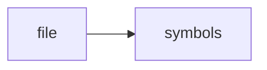

# README.md

> **Language**: `markdown` | **Symbols**: 4

## Purpose

Defines 4 indexed symbol(s): # ragd, ## Quick Start, ## Feature Overview, ## Agent Integration.

## Public Symbols

| Symbol | Type | Lines | Description |
|---|---|---:|---|
| [[symbols/ragd/ragd-L1-d5c72f84|# ragd]] | section | 1-6 | # ragd |
| [[symbols/ragd/Quick_Start-L7-34b63a5e|## Quick Start]] | section | 7-25 | ## Quick Start |
| [[symbols/ragd/Feature_Overview-L26-5871f3db|## Feature Overview]] | section | 26-47 | ## Feature Overview |
| [[symbols/ragd/Agent_Integration-L48-8bc67a22|## Agent Integration]] | section | 48-65 | ## Agent Integration |

## Imports

- *(none indexed)*

## Call Graph

## Recent Changes

> Content hash: `8bc67a225e385859`. Last modified epoch: `1778728344`.
