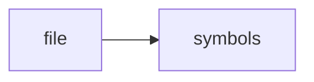

# agent_memory.h

> **Language**: `cpp` | **Symbols**: 7

## Purpose

Defines 7 indexed symbol(s): top_level, AgentMemory, AgentMemory, start, end.

## Public Symbols

| Symbol | Type | Lines | Description |
|---|---|---:|---|
| [[symbols/ragd/include/ragd/top_level-L1-d3a11527|top_level]] | block | 1-6 | top_level |
| [[symbols/ragd/include/ragd/AgentMemory-L7-b791cc9a|AgentMemory]] | class | 7-8 | AgentMemory |
| [[symbols/ragd/include/ragd/AgentMemory-L9-52398ba3|AgentMemory]] | function | 9-9 | AgentMemory |
| [[symbols/ragd/include/ragd/start-L10-bb4787a2|start]] | function | 10-10 | start |
| [[symbols/ragd/include/ragd/end-L11-63936e87|end]] | function | 11-11 | end |
| [[symbols/ragd/include/ragd/touch-L12-ee927fd4|touch]] | function | 12-12 | touch |
| [[symbols/ragd/include/ragd/remember-L13-e0e0aaa5|remember]] | function | 13-19 | remember |

## Imports

- *(none indexed)*

## Call Graph

## Recent Changes

> Content hash: `e0e0aaa5e0d3c665`. Last modified epoch: `-4659111569941246014`.
