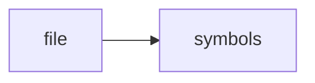

# bm25.h

> **Language**: `cpp` | **Symbols**: 3

## Purpose

Defines 3 indexed symbol(s): top_level, BM25Engine, BM25Engine.

## Public Symbols

| Symbol | Type | Lines | Description |
|---|---|---:|---|
| [[symbols/ragd/include/ragd/top_level-L1-c13c3942|top_level]] | block | 1-6 | top_level |
| [[symbols/ragd/include/ragd/BM25Engine-L7-7097ffa2|BM25Engine]] | class | 7-8 | BM25Engine |
| [[symbols/ragd/include/ragd/BM25Engine-L9-929972aa|BM25Engine]] | function | 9-16 | BM25Engine |

## Imports

- *(none indexed)*

## Call Graph

## Recent Changes

> Content hash: `929972aaafc7006b`. Last modified epoch: `-4659111569941246014`.
