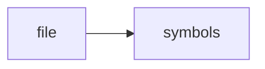

# config.h

> **Language**: `cpp` | **Symbols**: 2

## Purpose

Defines 2 indexed symbol(s): top_level, Config.

## Public Symbols

| Symbol | Type | Lines | Description |
|---|---|---:|---|
| [[symbols/ragd/include/ragd/top_level-L1-55a2a55b|top_level]] | block | 1-8 | top_level |
| [[symbols/ragd/include/ragd/Config-L9-98e039b0|Config]] | class | 9-48 | Config |

## Imports

- *(none indexed)*

## Call Graph

## Recent Changes

> Content hash: `98e039b0a2f441ca`. Last modified epoch: `-4659110061169454365`.
