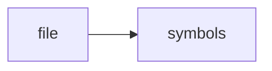

# http_api.h

> **Language**: `cpp` | **Symbols**: 2

## Purpose

Defines 2 indexed symbol(s): top_level, HttpApi.

## Public Symbols

| Symbol | Type | Lines | Description |
|---|---|---:|---|
| [[symbols/ragd/include/ragd/top_level-L1-f522d3d3|top_level]] | block | 1-9 | top_level |
| [[symbols/ragd/include/ragd/HttpApi-L10-4a25550b|HttpApi]] | class | 10-22 | HttpApi |

## Imports

- *(none indexed)*

## Call Graph

## Recent Changes

> Content hash: `4a25550bacf4d654`. Last modified epoch: `-4659111569941246014`.
