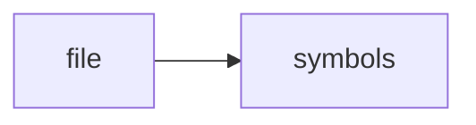

# indexer.h

> **Language**: `cpp` | **Symbols**: 2

## Purpose

Defines 2 indexed symbol(s): top_level, Indexer.

## Public Symbols

| Symbol | Type | Lines | Description |
|---|---|---:|---|
| [[symbols/ragd/include/ragd/top_level-L1-9015fbe0|top_level]] | block | 1-12 | top_level |
| [[symbols/ragd/include/ragd/Indexer-L13-f8427408|Indexer]] | class | 13-27 | Indexer |

## Imports

- *(none indexed)*

## Call Graph

## Recent Changes

> Content hash: `f8427408032fe08f`. Last modified epoch: `-4659109573881520937`.
