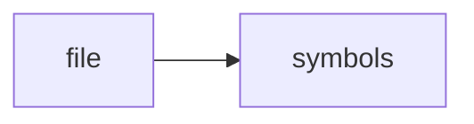

# sqlite_compat.h

> **Language**: `cpp` | **Symbols**: 3

## Purpose

Defines 3 indexed symbol(s): top_level, sqlite3, sqlite3_stmt.

## Public Symbols

| Symbol | Type | Lines | Description |
|---|---|---:|---|
| [[symbols/ragd/include/ragd/top_level-L1-99cdd6bc|top_level]] | block | 1-6 | top_level |
| [[symbols/ragd/include/ragd/sqlite3-L7-5d73b46b|sqlite3]] | class | 7-7 | sqlite3 |
| [[symbols/ragd/include/ragd/sqlite3_stmt-L8-1114f901|sqlite3_stmt]] | class | 8-38 | sqlite3_stmt |

## Imports

- *(none indexed)*

## Call Graph

## Recent Changes

> Content hash: `1114f901b2fce81d`. Last modified epoch: `-4659111277285287820`.
