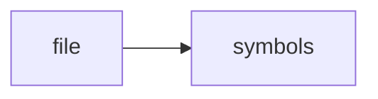

# storage.h

> **Language**: `cpp` | **Symbols**: 3

## Purpose

Defines 3 indexed symbol(s): top_level, Statement, Storage.

## Public Symbols

| Symbol | Type | Lines | Description |
|---|---|---:|---|
| [[symbols/ragd/include/ragd/top_level-L1-56a37724|top_level]] | block | 1-12 | top_level |
| [[symbols/ragd/include/ragd/Statement-L13-e1f60c3c|Statement]] | class | 13-36 | Statement |
| [[symbols/ragd/include/ragd/Storage-L37-ed11f07b|Storage]] | class | 37-89 | Storage |

## Imports

- *(none indexed)*

## Call Graph

## Recent Changes

> Content hash: `ed11f07bf524cc41`. Last modified epoch: `-4659109985729463124`.
