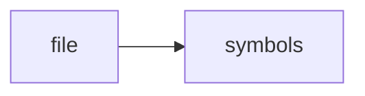

# temporal.h

> **Language**: `cpp` | **Symbols**: 1

## Purpose

Defines 1 indexed symbol(s): file.

## Public Symbols

| Symbol | Type | Lines | Description |
|---|---|---:|---|
| [[symbols/ragd/include/ragd/file-L1-770c72d2|file]] | block | 1-13 | file |

## Imports

- *(none indexed)*

## Call Graph

## Recent Changes

> Content hash: `770c72d215fc018a`. Last modified epoch: `-4659109734865499239`.
