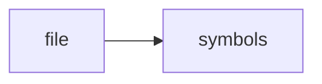

# todo_engine.h

> **Language**: `cpp` | **Symbols**: 2

## Purpose

Defines 2 indexed symbol(s): top_level, TodoEngine.

## Public Symbols

| Symbol | Type | Lines | Description |
|---|---|---:|---|
| [[symbols/ragd/include/ragd/top_level-L1-cb9ab246|top_level]] | block | 1-9 | top_level |
| [[symbols/ragd/include/ragd/TodoEngine-L10-1940d984|TodoEngine]] | class | 10-16 | TodoEngine |

## Imports

- *(none indexed)*

## Call Graph

## Recent Changes

> Content hash: `1940d98470ba191b`. Last modified epoch: `-4659111569941246014`.
