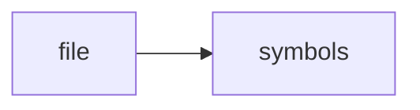

# types.h

> **Language**: `cpp` | **Symbols**: 6

## Purpose

Defines 6 indexed symbol(s): top_level, Chunk, QueryResult, Todo, Decision.

## Public Symbols

| Symbol | Type | Lines | Description |
|---|---|---:|---|
| [[symbols/ragd/include/ragd/top_level-L1-840a6647|top_level]] | block | 1-8 | top_level |
| [[symbols/ragd/include/ragd/Chunk-L9-82c2a3a1|Chunk]] | class | 9-27 | Chunk |
| [[symbols/ragd/include/ragd/QueryResult-L28-1b453357|QueryResult]] | class | 28-44 | QueryResult |
| [[symbols/ragd/include/ragd/Todo-L45-c95946c4|Todo]] | class | 45-58 | Todo |
| [[symbols/ragd/include/ragd/Decision-L59-a7751b18|Decision]] | class | 59-69 | Decision |
| [[symbols/ragd/include/ragd/Session-L70-ddc446d2|Session]] | class | 70-83 | Session |

## Imports

- *(none indexed)*

## Call Graph

## Recent Changes

> Content hash: `ddc446d2fe7c8c16`. Last modified epoch: `-4659110072273452899`.
