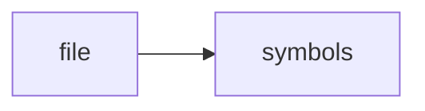

# vector_store.h

> **Language**: `cpp` | **Symbols**: 3

## Purpose

Defines 3 indexed symbol(s): top_level, VectorStore, size.

## Public Symbols

| Symbol | Type | Lines | Description |
|---|---|---:|---|
| [[symbols/ragd/include/ragd/top_level-L1-e1793f25|top_level]] | block | 1-10 | top_level |
| [[symbols/ragd/include/ragd/VectorStore-L11-2ff67387|VectorStore]] | class | 11-14 | VectorStore |
| [[symbols/ragd/include/ragd/size-L15-25899ca4|size]] | function | 15-25 | size |

## Imports

- *(none indexed)*

## Call Graph

## Recent Changes

> Content hash: `25899ca4386240aa`. Last modified epoch: `-4659111569941246014`.
