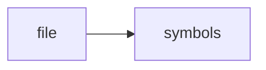

# watcher.h

> **Language**: `cpp` | **Symbols**: 2

## Purpose

Defines 2 indexed symbol(s): top_level, Watcher.

## Public Symbols

| Symbol | Type | Lines | Description |
|---|---|---:|---|
| [[symbols/ragd/include/ragd/top_level-L1-93a18c2d|top_level]] | block | 1-10 | top_level |
| [[symbols/ragd/include/ragd/Watcher-L11-699e1115|Watcher]] | class | 11-25 | Watcher |

## Imports

- *(none indexed)*

## Call Graph

## Recent Changes

> Content hash: `699e1115a4ca76e5`. Last modified epoch: `-4659111569941246014`.
