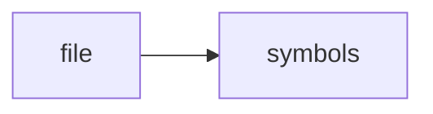

# ragd_mcp_stdio.py

> **Language**: `python` | **Symbols**: 8

## Purpose

Defines 8 indexed symbol(s): top_level, _ragd_tool, ragd_query, ragd_handoff_read, ragd_todo_list.

## Public Symbols

| Symbol | Type | Lines | Description |
|---|---|---:|---|
| [[symbols/ragd/scripts/top_level-L1-d6619e53|top_level]] | block | 1-16 | top_level |
| [[symbols/ragd/scripts/ragd_tool-L17-ea7496b2|_ragd_tool]] | function | 17-47 | _ragd_tool |
| [[symbols/ragd/scripts/ragd_query-L48-28ebccc6|ragd_query]] | function | 48-53 | ragd_query |
| [[symbols/ragd/scripts/ragd_handoff_read-L54-7ee5960f|ragd_handoff_read]] | function | 54-59 | ragd_handoff_read |
| [[symbols/ragd/scripts/ragd_todo_list-L60-21f3484b|ragd_todo_list]] | function | 60-65 | ragd_todo_list |
| [[symbols/ragd/scripts/ragd_remember-L66-4483455a|ragd_remember]] | function | 66-79 | ragd_remember |
| [[symbols/ragd/scripts/ragd_todo_add-L80-3a711327|ragd_todo_add]] | function | 80-94 | ragd_todo_add |
| [[symbols/ragd/scripts/ragd_deadzone_report-L95-e8b23534|ragd_deadzone_report]] | function | 95-106 | ragd_deadzone_report |

## Imports

- *(none indexed)*

## Call Graph

## Recent Changes

> Content hash: `e8b235341181430b`. Last modified epoch: `-4659049943079485795`.
