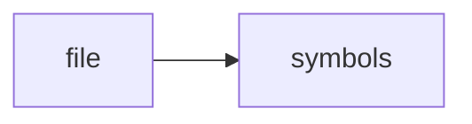

# bm25.cpp

> **Language**: `cpp` | **Symbols**: 2

## Purpose

Defines 2 indexed symbol(s): top_level, BM25Engine::query.

## Public Symbols

| Symbol | Type | Lines | Description |
|---|---|---:|---|
| [[symbols/ragd/src/top_level-L1-d9526163|top_level]] | block | 1-4 | top_level |
| [[symbols/ragd/src/BM25Engine_query-L5-d476776c|BM25Engine::query]] | function | 5-9 | BM25Engine::query |

## Imports

- *(none indexed)*

## Call Graph

## Recent Changes

> Content hash: `d476776c43a0ec55`. Last modified epoch: `-4659111465869263127`.
