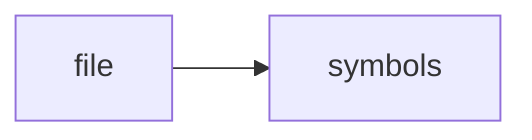

# dead_zone.cpp

> **Language**: `cpp` | **Symbols**: 2

## Purpose

Defines 2 indexed symbol(s): top_level, dead_zone_report_json.

## Public Symbols

| Symbol | Type | Lines | Description |
|---|---|---:|---|
| [[symbols/ragd/src/top_level-L1-b521c8c3|top_level]] | block | 1-9 | top_level |
| [[symbols/ragd/src/dead_zone_report_json-L10-6cee5f44|dead_zone_report_json]] | function | 10-55 | dead_zone_report_json |

## Imports

- *(none indexed)*

## Call Graph

## Recent Changes

> Content hash: `6cee5f446563df08`. Last modified epoch: `-4659108882733617133`.
