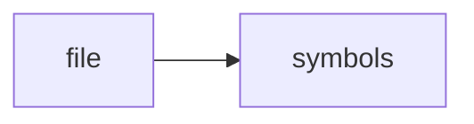

# http_api.cpp

> **Language**: `cpp` | **Symbols**: 9

## Purpose

Defines 9 indexed symbol(s): top_level, parse_body, json_response, json_response, int_param.

## Public Symbols

| Symbol | Type | Lines | Description |
|---|---|---:|---|
| [[symbols/ragd/src/top_level-L1-c070478d|top_level]] | block | 1-14 | top_level |
| [[symbols/ragd/src/parse_body-L15-c150d729|parse_body]] | function | 15-19 | parse_body |
| [[symbols/ragd/src/json_response-L20-30f1c9b8|json_response]] | function | 20-24 | json_response |
| [[symbols/ragd/src/json_response-L25-74752f00|json_response]] | function | 25-29 | json_response |
| [[symbols/ragd/src/int_param-L30-282f583d|int_param]] | function | 30-38 | int_param |
| [[symbols/ragd/src/int64_param-L39-93e3d1df|int64_param]] | function | 39-47 | int64_param |
| [[symbols/ragd/src/todo_from_json-L48-f1446c0f|todo_from_json]] | function | 48-62 | todo_from_json |
| [[symbols/ragd/src/todo_json-L63-a69ae798|todo_json]] | function | 63-82 | todo_json |
| [[symbols/ragd/src/HttpApi_run-L83-8bfe1dcb|HttpApi::run]] | function | 83-262 | HttpApi::run |

## Imports

- *(none indexed)*

## Call Graph

## Recent Changes

> Content hash: `8bfe1dcb6c9085a4`. Last modified epoch: `-4659109438945539567`.
