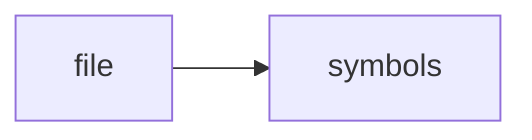

# main.cpp

> **Language**: `cpp` | **Symbols**: 2

## Purpose

Defines 2 indexed symbol(s): top_level, main.

## Public Symbols

| Symbol | Type | Lines | Description |
|---|---|---:|---|
| [[symbols/ragd/src/top_level-L1-ec938f68|top_level]] | block | 1-11 | top_level |
| [[symbols/ragd/src/main-L12-6ff3449e|main]] | function | 12-56 | main |

## Imports

- *(none indexed)*

## Call Graph

## Recent Changes

> Content hash: `6ff3449e8c3d2ea9`. Last modified epoch: `-4659109517601528351`.
