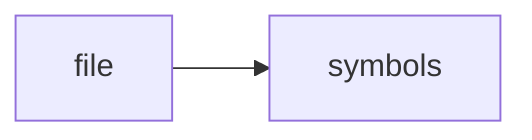

# session_bus.cpp

> **Language**: `cpp` | **Symbols**: 2

## Purpose

Defines 2 indexed symbol(s): top_level, broadcast.

## Public Symbols

| Symbol | Type | Lines | Description |
|---|---|---:|---|
| [[symbols/ragd/src/top_level-L1-6b2f6d7c|top_level]] | block | 1-6 | top_level |
| [[symbols/ragd/src/broadcast-L7-f1d91dfd|broadcast]] | function | 7-12 | broadcast |

## Imports

- *(none indexed)*

## Call Graph

## Recent Changes

> Content hash: `f1d91dfd1f97075b`. Last modified epoch: `-4659109762345495368`.
