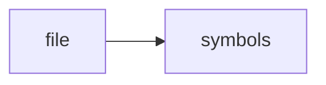

# temporal.cpp

> **Language**: `cpp` | **Symbols**: 5

## Purpose

Defines 5 indexed symbol(s): top_level, temporal_status_json, temporal_query_json, temporal_commits_json, temporal_file_timeline_json.

## Public Symbols

| Symbol | Type | Lines | Description |
|---|---|---:|---|
| [[symbols/ragd/src/top_level-L1-8c54366d|top_level]] | block | 1-6 | top_level |
| [[symbols/ragd/src/temporal_status_json-L7-5c46df23|temporal_status_json]] | function | 7-10 | temporal_status_json |
| [[symbols/ragd/src/temporal_query_json-L11-2054c0ee|temporal_query_json]] | function | 11-17 | temporal_query_json |
| [[symbols/ragd/src/temporal_commits_json-L18-3fbef776|temporal_commits_json]] | function | 18-28 | temporal_commits_json |
| [[symbols/ragd/src/temporal_file_timeline_json-L29-814c5fd4|temporal_file_timeline_json]] | function | 29-41 | temporal_file_timeline_json |

## Imports

- *(none indexed)*

## Call Graph

## Recent Changes

> Content hash: `814c5fd440bde8af`. Last modified epoch: `-4659109718321501589`.
