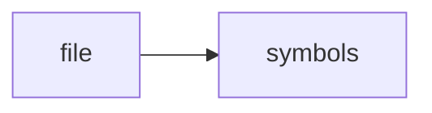

# todo_engine.cpp

> **Language**: `cpp` | **Symbols**: 3

## Purpose

Defines 3 indexed symbol(s): top_level, TodoEngine::priority_for, TodoEngine::extract.

## Public Symbols

| Symbol | Type | Lines | Description |
|---|---|---:|---|
| [[symbols/ragd/src/top_level-L1-f6d8804a|top_level]] | block | 1-9 | top_level |
| [[symbols/ragd/src/TodoEngine_priority_for-L10-ba68950a|TodoEngine::priority_for]] | function | 10-21 | TodoEngine::priority_for |
| [[symbols/ragd/src/TodoEngine_extract-L22-b317ed63|TodoEngine::extract]] | function | 22-46 | TodoEngine::extract |

## Imports

- *(none indexed)*

## Call Graph

## Recent Changes

> Content hash: `b317ed639ffcf2bd`. Last modified epoch: `-4659108896837615212`.
