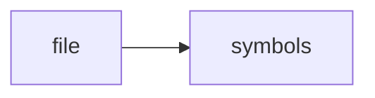

# vector_store.cpp

> **Language**: `cpp` | **Symbols**: 6

## Purpose

Defines 6 indexed symbol(s): top_level, tokenize, tf, cosine, VectorStore::add.

## Public Symbols

| Symbol | Type | Lines | Description |
|---|---|---:|---|
| [[symbols/ragd/src/top_level-L1-7b8d77b6|top_level]] | block | 1-9 | top_level |
| [[symbols/ragd/src/tokenize-L10-7e087e8c|tokenize]] | function | 10-20 | tokenize |
| [[symbols/ragd/src/tf-L21-7b89ca94|tf]] | function | 21-30 | tf |
| [[symbols/ragd/src/cosine-L31-aa892fb2|cosine]] | function | 31-41 | cosine |
| [[symbols/ragd/src/VectorStore_add-L42-4196c1f1|VectorStore::add]] | function | 42-46 | VectorStore::add |
| [[symbols/ragd/src/VectorStore_query-L47-ec3bdf59|VectorStore::query]] | function | 47-64 | VectorStore::query |

## Imports

- *(none indexed)*

## Call Graph

## Recent Changes

> Content hash: `ec3bdf5973460c41`. Last modified epoch: `-4659111465869263127`.
