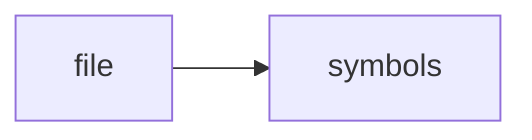

# watcher.cpp

> **Language**: `cpp` | **Symbols**: 3

## Purpose

Defines 3 indexed symbol(s): top_level, Watcher::start, Watcher::stop.

## Public Symbols

| Symbol | Type | Lines | Description |
|---|---|---:|---|
| [[symbols/ragd/src/top_level-L1-c12a6493|top_level]] | block | 1-21 | top_level |
| [[symbols/ragd/src/Watcher_start-L22-54588704|Watcher::start]] | function | 22-96 | Watcher::start |
| [[symbols/ragd/src/Watcher_stop-L97-9cd26075|Watcher::stop]] | function | 97-102 | Watcher::stop |

## Imports

- *(none indexed)*

## Call Graph

## Recent Changes

> Content hash: `9cd26075f7b84f53`. Last modified epoch: `-4659109535421526170`.
