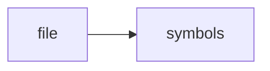

# test_storage.cpp

> **Language**: `cpp` | **Symbols**: 2

## Purpose

Defines 2 indexed symbol(s): top_level, main.

## Public Symbols

| Symbol | Type | Lines | Description |
|---|---|---:|---|
| [[symbols/ragd/tests/top_level-L1-6f722f5c|top_level]] | block | 1-4 | top_level |
| [[symbols/ragd/tests/main-L5-5271c662|main]] | function | 5-22 | main |

## Imports

- *(none indexed)*

## Call Graph

## Recent Changes

> Content hash: `5271c662e7a15dc6`. Last modified epoch: `-4659111330461280177`.
