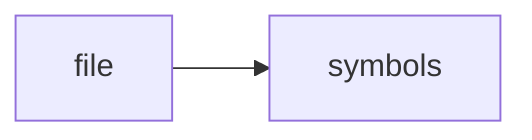

# test_temporal.cpp

> **Language**: `cpp` | **Symbols**: 2

## Purpose

Defines 2 indexed symbol(s): top_level, main.

## Public Symbols

| Symbol | Type | Lines | Description |
|---|---|---:|---|
| [[symbols/ragd/tests/top_level-L1-10f88912|top_level]] | block | 1-8 | top_level |
| [[symbols/ragd/tests/main-L9-d616a5f8|main]] | function | 9-25 | main |

## Imports

- *(none indexed)*

## Call Graph

## Recent Changes

> Content hash: `d616a5f8896eb3f9`. Last modified epoch: `-4659109293289558864`.
